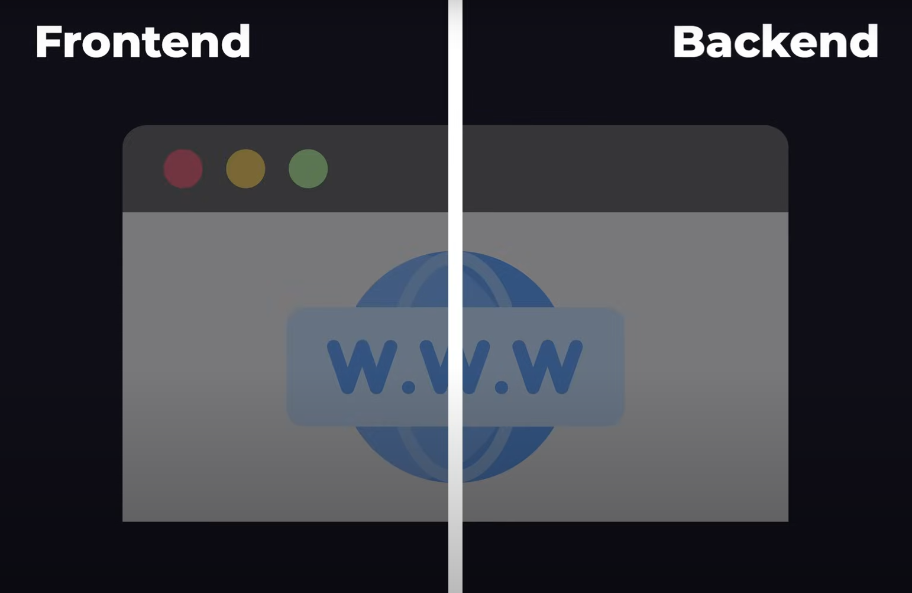

# What is Backend?
## 📌 ব্যাকএন্ড কী?

প্রতিটি ওয়েবসাইট এর ই দুটি অংশ থাকে ফ্রনটেন্ড এবং ব্যাকএন্ড । ফ্রনটেন্ড হচ্ছে যা কিছু আমরা ওয়েবসাইট যা দেখি ও interact করি । অন্যদিকে ব্যাকএন্ড আমাদের আমাদের interaction এ প্রয়োজনীয় যতসব data save,update এবং manage করে। 

আমরা প্রতিদিন অসংখ্য ওয়েবসাইট ও অ্যাপ ব্যবহার করি—দারাজে অর্ডার দেই, ফেসবুকে পোস্ট করি, ইউটিউবে ভিডিও দেখি। এই সমস্ত সিস্টেমের সামনে যে অংশটা আমরা দেখি ও ব্যবহার করি, সেটা হলো **Frontend (ফ্রন্টএন্ড)**। আর ভিতরে যে অংশটি সব কিছু নিয়ন্ত্রণ করে, সেটাই হলো **Backend (ব্যাকএন্ড)**।

### উদাহরণ:

ধরুন আপনি Daraz-এ গিয়ে একটি ঘড়ি কিনলেন। আপনি যা দেখলেন তা হলো ছবিগুলো, দাম, “Add to Cart” বাটন ইত্যাদি—এইগুলো সব ফ্রন্টএন্ড। 

কিন্তু আপনি যখন অর্ডার করেন, তখন আপনার নাম, ঠিকানা, পেমেন্ট ইনফো কোথায় যায়? এইসব ডেটা যেখানে সংরক্ষিত হয়, প্রসেস হয় এবং নিরাপদভাবে ব্যবস্থাপনা করা হয়, সেই জায়গাটাই হচ্ছে **ব্যাকএন্ড**। 

<aside>
💡

সহজ ও এককথায়, ব্যাকএন্ড (Backend) হলো একটি ওয়েবসাইট বা অ্যাপের অভ্যন্তরীণ অংশ, যা ডেটা প্রক্রিয়াকরণ, ব্যবসায়িক লজিক ও ব্যবহারকারীর অনুরোধ অনুযায়ী সঠিক তথ্য সরবরাহের কাজ করে। 

</aside>

---