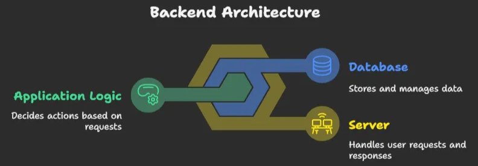

# How Backend works?
## ⚙️ ব্যাকএন্ড কীভাবে কাজ করে?

ব্যাকএন্ড মূলত তিনটি প্রধান জিনিস নিয়ে কাজ করে:

1. **Server (সার্ভার)** – আপনার অনুরোধ গ্রহণ করে এবং উত্তর পাঠায়।
2. **Database (ডাটাবেস)** – সব ডেটা সংরক্ষণ করে (যেমন: ইউজারের ইনফো, পণ্যের তালিকা ইত্যাদি)।
3. **Application Logic** – কোন অনুরোধে কী কাজ হবে, তা নির্ধারণ করে (যেমন: কেউ লগইন করলে কী হবে?)।

### বাস্তব উদাহরণ:

আপনি রেস্টুরেন্টে খেতে গেছেন। আপনি ওয়েটারকে বললেন “একটা বিরিয়ানি দিন”। এখন:

- আপনি = ইউজার
- রেস্টুরেন্টের বসার জায়গা = ফ্রন্টএন্ড
- ওয়েটার = এপিআই
- কিচেন/সেফ = ব্যাকএন্ড
- রাঁধুনির রান্নার নিয়ম = ব্যাকএন্ড লজিক

---