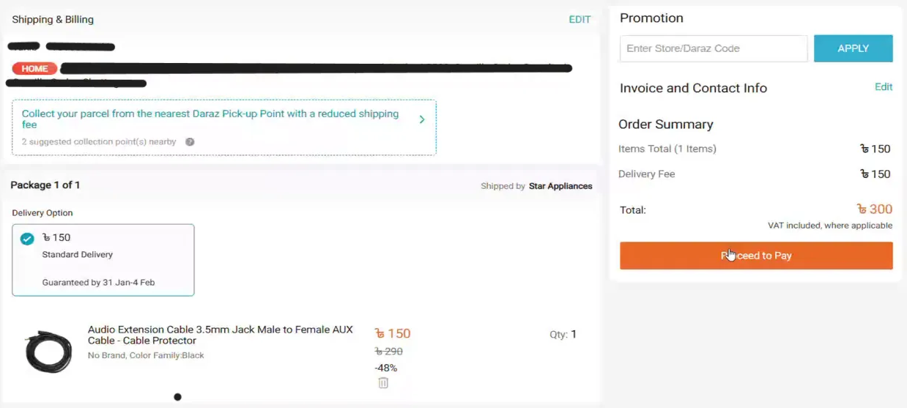
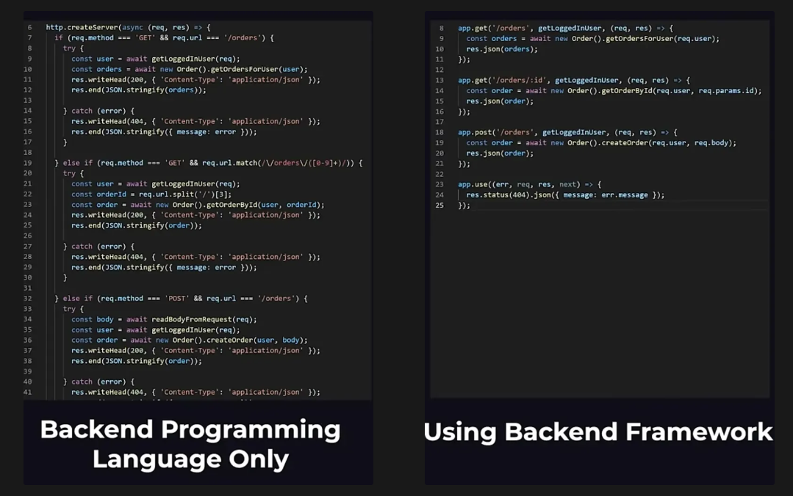

# Why do we need backend language and it's framework?

## ❓ কেন ব্যাকএন্ড প্রোগ্রামিং ল্যাঙ্গুয়েজ দরকার?

কম্পিউটার নিজে নিজে কিছু বুঝতে পারে না। তাকে বলে দিতে হয় কখন কী করতে হবে। এই নির্দেশনা দেওয়ার জন্য প্রয়োজন **ব্যাকএন্ড প্রোগ্রামিং ল্যাঙ্গুয়েজ**। 

মনে করি, দারাজ এর website এ আছি। তাহলে এখানে data গুলো কী কী হতে পারে? এখানে তথ্যগুলো হলো userdata যেমন - নাম,ঠিকানা,cart history, order & payment history etc. এখন আমার একটা product ভালো লাগলো এবং order  করব। Order করার পর কী হবে?

আচ্ছা একদম base থেকে  শুরু করি যেকোনো কম্পিউটার ইন্টারনেটে আরেকটা  কম্পিউটার এ মেসেজ পাঠাতে পারে।আরো সহজ করার জন্য ভাবেন ডারাজ এর office এ একটা কম্পিউটার আছে ওটা আমাদের ডাটা রিসিভ করবে কিন্ত by default কম্পিউটার ডাটা রিসিভ করতে পারেনা। 

ধরুন, আপনি একটি রেস্টুরেন্টে খেতে গেছেন। আপনি ওয়েটারকে বললেন, "একটা বিরিয়ানি দিন।" কিন্তু একটি রেস্টুরেন্ট ডিফল্টভাবে খাবার পরিবেশন করতে পারে না, তাকে অবশ্যই অর্ডার নিতে, রান্না করতে, এবং খাবার প্রস্তুত করতে একটি কার্যকরী ব্যবস্থা (ব্যাকএন্ড) দরকার। 

প্রতিটা প্রোগামিং ল্যাগুয়েজই একটা feature আছে যা আমাদের কম্পিউটারকে একটা সার্ভার পরিণত করার সুবিধা দেয় | 

**জনপ্রিয় ব্যাকএন্ড ল্যাঙ্গুয়েজ:**

| 🧠 Programming Language | 🚀 Backend Framework(s) |
| --- | --- |
| JavaScript (Node.js) | Express.js, NestJS |
| Python | Django, Flask |
| Java | Spring Boot |
| PHP | Laravel |
| Ruby | Ruby on Rails |

---

## 🧱 ব্যাকএন্ড ফ্রেমওয়ার্ক কী?

শুধু ব্যাকএন্ড প্রোগ্রামিং ল্যাঙ্গুয়েজ দিয়ে পুরোপুরি স্ক্র্যাচ থেকে কোড লেখা সময়সাপেক্ষ, জটিল এবং অনেক বেশি কাজের চাপ তৈরি করে। প্রতিবার নতুন করে authentication, routing, validation, database connection ইত্যাদি তৈরি করা কষ্টকর।

এই সমস্যা সমাধানের জন্যই **Framework** ব্যবহৃত হয়। ফ্রেমওয়ার্ক হচ্ছে এমন একটি টুল বা কাঠামো যা ব্যাকএন্ড ডেভেলপমেন্টের জন্য প্রয়োজনীয় অনেক ফিচার আগে থেকেই তৈরি করে রাখে।

আমরা শুধু দরকারি অংশ কাস্টমাইজ করে ব্যবহার করি। এতে সময় বাঁচে, কোড পরিষ্কার থাকে এবং ডেভেলপমেন্ট অনেক দ্রুত হয়।

**উদাহরণ:**

## 🔧 জনপ্রিয় ব্যাকএন্ড ফ্রেমওয়ার্ক ও তাদের ল্যাঙ্গুয়েজ

ব্যাকএন্ড কোডিং: শুধু প্রোগ্রামিং ল্যাংগুয়েজ বনাম ফ্রেমওয়ার্ক

| 🧠 Language | ⚙️ Framework(s) | 🔎 কেন ব্যবহার করবো? |
| --- | --- | --- |
| JavaScript | Express.js | সহজ, দ্রুত, Node.js ভিত্তিক API তৈরি করার জন্য সবচেয়ে হালকা ও জনপ্রিয় ফ্রেমওয়ার্ক। |
| Python | Django / Flask | Django – built-in admin, security ও structure-rich; Flask – lightweight ও flexible। |
| Java | Spring Boot | বড় স্কেল-এর প্রজেক্টের জন্য উপযোগী, secure ও scalable। |

### 🆚 ব্যাকএন্ড কোডিং: শুধু প্রোগ্রামিং ল্যাংগুয়েজ বনাম ফ্রেমওয়ার্ক

> কোড ছোট, পরিষ্কার ও সহজ করতে ব্যাকএন্ড ফ্রেমওয়ার্ক অপরিহার্য!
> 

শুধুমাত্র Node.js ব্যবহার করে লেখা কোড দেখানো হয়েছে – যেখানে রাউট হ্যান্ডলিং, রেসপন্স, ও এরর ম্যানেজমেন্ট সব নিজে লিখতে হচ্ছে।

Express.js ফ্রেমওয়ার্ক ব্যবহার করে একই কাজ অনেক কম কোডে, সহজে এবং সুন্দরভাবে করা হয়েছে।

---