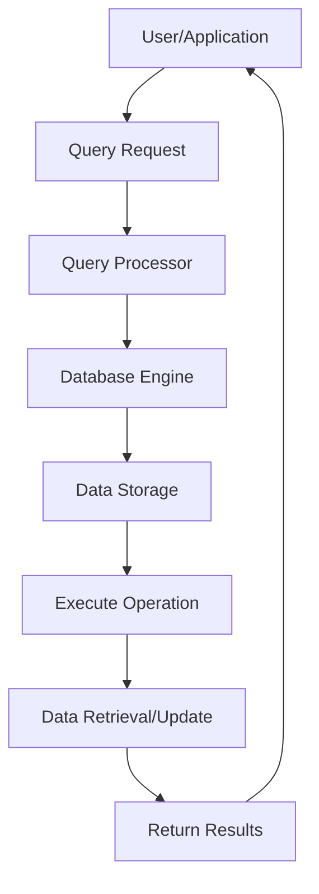
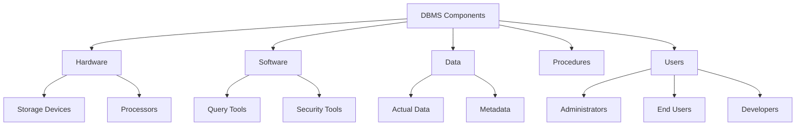
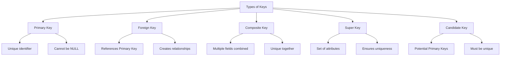
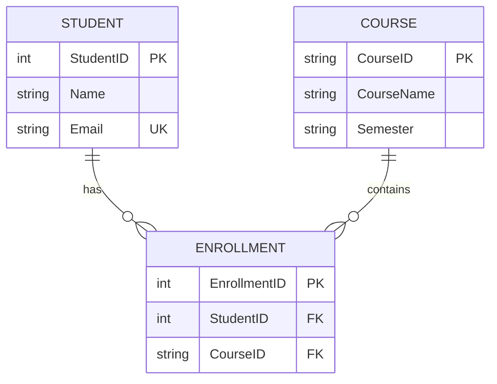
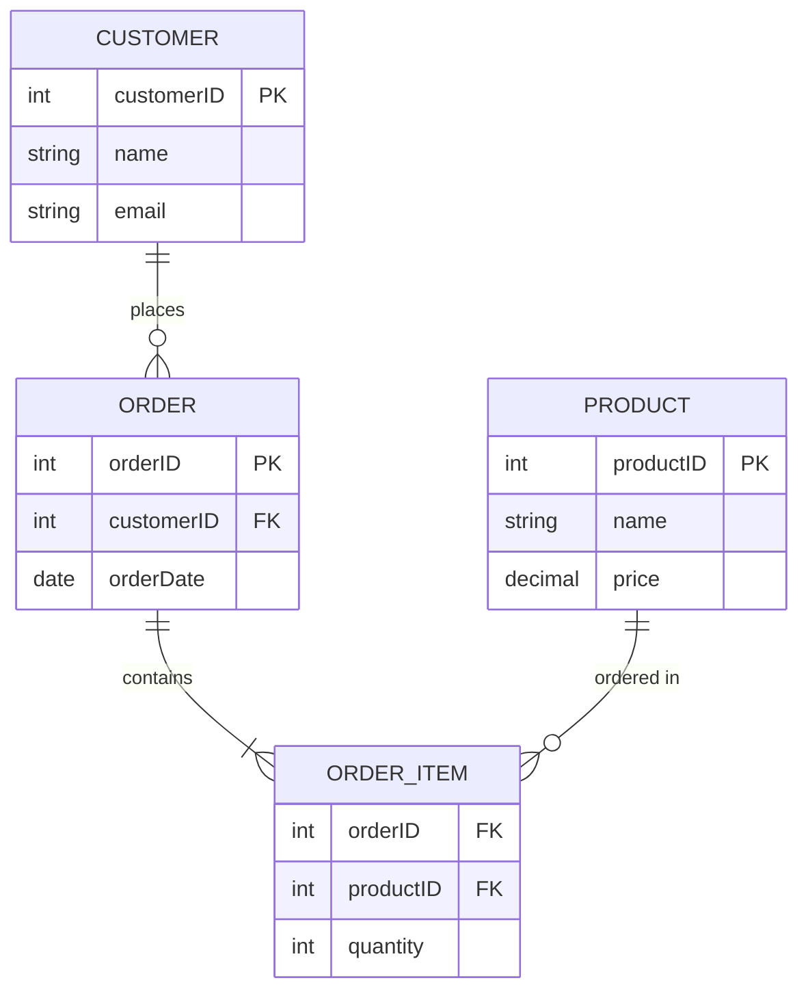
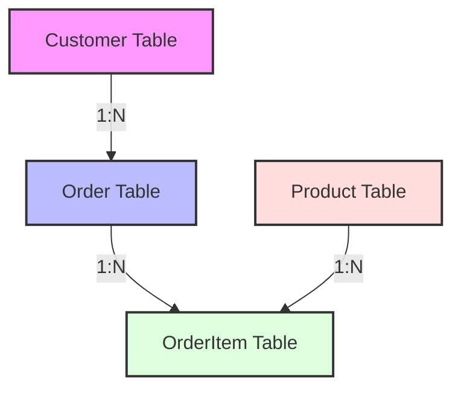

# What & Why?

Here's a concise comparison of **File System** vs **DBMS (Database Management System)**, with a focus on RDBMS since you previously asked about it:

| **Aspect**              | **File System**                                                                 | **DBMS (e.g., RDBMS)**                                                       |
| ----------------------- | ------------------------------------------------------------------------------- | ---------------------------------------------------------------------------- |
| **Definition**          | A method for storing and organizing files on a storage device (e.g., HDD, SSD). | A software system for creating, managing, and querying structured databases. |
| **Data Storage**        | Data stored in files (e.g., text, CSV, JSON) with no inherent structure.        | Data stored in structured tables with defined schemas (rows, columns).       |
| **Data Organization**   | Hierarchical (folders/directories). No built-in relationships between files.    | Relational (tables linked via keys). Supports complex relationships.         |
| **Data Access**         | Manual access via application code or file operations (read/write).             | Query-based access using SQL. Supports complex queries and joins.            |
| **Data Integrity**      | No built-in mechanisms. Integrity depends on application logic.                 | Enforces integrity via constraints (e.g., primary keys, foreign keys).       |
| **Concurrency Control** | Limited or no support. File locking can cause conflicts.                        | Robust concurrency control (e.g., transactions, locking mechanisms).         |
| **Scalability**         | Limited; struggles with large datasets or multiple users.                       | Designed for scalability; handles large datasets and concurrent users.       |
| **Security**            | Basic access control (e.g., file permissions).                                  | Advanced security (user authentication, role-based access, encryption).      |
| **Data Redundancy**     | High risk of redundancy; no normalization.                                      | Reduces redundancy via normalization and relational design.                  |
| **Transaction Support** | No transaction management. Partial updates can lead to inconsistency.           | Supports ACID transactions for reliable, consistent operations.              |
| **Examples**            | Windows NTFS, Linux ext4, FAT32.                                                | MySQL, PostgreSQL, Oracle, SQL Server.                                       |
| **Use Cases**           | Simple file storage (documents, logs, small-scale apps).                        | Complex applications (banking, e-commerce, enterprise systems).              |

## Key Differences File System Vs DBMS:

- **Structure**: File systems store unstructured or semi-structured data in files, while DBMS (RDBMS) uses structured tables with predefined schemas.
- **Querying**: File systems require custom code to search or manipulate data; DBMS uses standardized SQL for efficient queries.
- **Reliability**: DBMS ensures data consistency and integrity through transactions and constraints, unlike file systems.
- **Performance**: DBMS is optimized for complex operations and large-scale data; file systems are better for simple, sequential access.

If you need a deeper dive into any specific aspect or examples, let me know!

# What is RDBMS?

An RDBMS (Relational Database Management System) is software that manages databases using a relational model, where data is organized into tables with rows and columns. Tables are linked through keys (primary and foreign), enabling structured data storage, retrieval, and manipulation via SQL (Structured Query Language). Examples include MySQL, PostgreSQL, Oracle, and SQL Server. It ensures data integrity, supports ACID transactions (Atomicity, Consistency, Isolation, Durability), and is widely used for applications requiring structured data management.

## What is Database?

A database is a structured collection of related data that represents real-world entities and is organized for reading, writing, and performing operations on that data.

For example, here's a simple database table representing employees:

| Employee ID | Name          | Department | Salary |
| ----------- | ------------- | ---------- | ------ |
| 101         | John Smith    | IT         | 75000  |
| 102         | Sarah Johnson | HR         | 65000  |
| 103         | Mike Brown    | Sales      | 70000  |

## Database Operation Cycle

Here's a flowchart showing the basic database operation cycle:

This diagram illustrates how data flows through a database system, from the initial user request to the final result delivery.

## Historical Origin of the Database Icon

The drum-like icon commonly used to represent databases is a historical reference to drum memory, one of the earliest forms of computer memory storage devices used in the 1950s and 1960s.

Magnetic drums were cylindrical metal devices coated with magnetic material that could store and retrieve data. They were among the first random-access storage devices used in early computer systems.

Although modern databases no longer use drum memory (having evolved to use more advanced storage technologies like SSDs and hard drives), the drum icon has remained as a symbolic representation of data storage in computing, serving as a reminder of the technology's evolution.

This iconic symbol helps maintain a connection to computing history while representing the core function of databases: storing and managing data systematically.

# What is DBMS?

A Database Management System (DBMS) is software designed to store, retrieve, define, and manage data in a database. It acts as an interface between the database and its end users or application programs.

## Key Components of DBMS

## Why Use DBMS?

- **Data Independence:** Separates application programs from complex physical data storage details
- **Data Integrity:** Maintains accuracy and consistency of data
- **Data Security:** Provides access control and data protection
- **Data Sharing:** Allows multiple users to access data simultaneously
- **Backup and Recovery:** Provides methods to restore data in case of failures

## Example of DBMS Usage

| Scenario           | DBMS Solution               | Benefit                         |
| ------------------ | --------------------------- | ------------------------------- |
| Library Management | Tracking books and members  | Efficient book lending system   |
| Banking System     | Managing customer accounts  | Secure transaction processing   |
| School Records     | Student database management | Easy access to academic records |

These examples demonstrate how DBMS helps organizations manage their data effectively while maintaining security and accessibility.

# Types of Database Models

Database models define how data is structured, stored, and manipulated within a database system. Here are the main types:

## 1. Hierarchical Model

Data is organized in a tree-like structure with parent-child relationships. Each parent can have multiple children, but each child has only one parent.

## 2. Network Model

Similar to the hierarchical model, but allows many-to-many relationships between entities. A child can have multiple parents.

## 3. Relational Model

The most widely used database model today. Data is organized into tables (relations) with rows and columns.

### Key Features of Relational Model:

- **Tables (Relations):** Data is stored in tables with rows (tuples) and columns (attributes)
- **Primary Keys:** Unique identifiers for each row in a table
- **Foreign Keys:** Fields that link to primary keys in other tables
- **Relationships:** One-to-one, one-to-many, and many-to-many relationships between tables

## 4. Object-Oriented Model

Data is stored as objects, similar to object-oriented programming. Objects contain both data and methods to manipulate the data.

## 5. Document Model

Data is stored in flexible, JSON-like documents. Popular in NoSQL databases like MongoDB.

## 6. Graph Model

Designed for data whose relationships are best represented as a network of nodes and edges.

| Model Type | Best Used For                            | Example Database      |
| ---------- | ---------------------------------------- | --------------------- |
| Relational | Structured data with clear relationships | MySQL, PostgreSQL     |
| Document   | Semi-structured data, flexible schemas   | MongoDB, CouchDB      |
| Graph      | Highly connected data                    | Neo4j, Amazon Neptune |

The choice of database model depends on factors like data structure, scalability requirements, and application needs.

## Anatomy of a Table (Relation)

A table in a relational database has specific components that define its structure:

- **Relation (Table):** The entire table structure that holds the data
- **Tuple (Row):** A single record in the table
- **Attribute (Column):** A field that defines a specific characteristic of the data
- **Domain:** The set of allowable values for an attribute

Here's an example of a table's anatomy:

| **Attribute Names →** | StudentID | Name        | Age | Course           |
| --------------------- | --------- | ----------- | --- | ---------------- |
| **↓ Tuple (Row)**     | 1001      | Alice Smith | 20  | Computer Science |
|                       | 1002      | Bob Johnson | 22  | Mathematics      |
|                       | 1003      | Carol Davis | 21  | Physics          |

Key characteristics of a relation:

- **Atomic Values:** Each cell contains a single, indivisible value
- **Unique Rows:** No two rows in a table can be identical
- **Column Order:** The order of columns is not significant
- **Row Order:** The order of rows is not significant

# Types of Keys in RDBMS

Keys play a crucial role in establishing relationships between tables and maintaining data integrity in a relational database. Here are the different types of keys:

## 1. Primary Key

A primary key uniquely identifies each record in a table. It must contain unique values and cannot contain NULL values.

| **StudentID (Primary Key)** | Name          | Course           |
| --------------------------- | ------------- | ---------------- |
| 101                         | John Smith    | Computer Science |
| 102                         | Emma Davis    | Physics          |
| 103                         | Michael Brown | Mathematics      |

## 2. Foreign Key

A foreign key is a field that links to the primary key of another table, creating relationships between tables.

| **EnrollmentID** | StudentID (Foreign Key) | CourseID |
| ---------------- | ----------------------- | -------- |
| 1                | 101                     | CS101    |
| 2                | 102                     | PH101    |
| 3                | 103                     | MT101    |

## 3. Composite Key

A composite key consists of multiple fields combined to uniquely identify records.

| **CourseID** | **SemesterID** | CourseName                  |
| ------------ | -------------- | --------------------------- |
| CS101        | SEM1           | Introduction to Programming |
| CS101        | SEM2           | Introduction to Programming |
| PH101        | SEM1           | Basic Physics               |

## 4. Super Key

A super key is a set of one or more attributes that can uniquely identify a record in a table.

## 5. Candidate Key

Candidate keys are attributes that could potentially serve as the primary key. For example, in a student table, both StudentID and email address could be candidate keys.

## Example of Key Relationships

This diagram shows how different types of keys work together to create relationships between tables in a database system.

## Key Characteristics Summary

- **Primary Key:** Unique identifier, cannot be null, only one per table
- **Foreign Key:** References primary key of another table, can be null, multiple allowed
- **Composite Key:** Multiple fields combined to ensure uniqueness
- **Super Key:** Any combination of fields that ensures uniqueness
- **Candidate Key:** Potential primary keys that could uniquely identify records

# Database Design Techniques

Here are the key techniques for designing an effective database:

## 1. Entity Relationship Diagram (ERD)

ERDs help visualize the relationships between different entities in your database.

## 2. Normalization Example

Here's how to normalize a database from 1NF to 3NF:

### Un-normalized Table:

| OrderID | CustomerName | CustomerEmail  | Products            |
| ------- | ------------ | -------------- | ------------------- |
| 1       | John Smith   | john@email.com | Book, Pen, Notebook |

### First Normal Form (1NF):

| OrderID | CustomerName | CustomerEmail  | Product  |
| ------- | ------------ | -------------- | -------- |
| 1       | John Smith   | john@email.com | Book     |
| 1       | John Smith   | john@email.com | Pen      |
| 1       | John Smith   | john@email.com | Notebook |

### Third Normal Form (3NF):

Split into multiple tables:

### Customers Table:

| CustomerID | CustomerName | CustomerEmail  |
| ---------- | ------------ | -------------- |
| 1          | John Smith   | john@email.com |

### Orders Table:

| OrderID | CustomerID |
| ------- | ---------- |
| 1       | 1          |

### OrderItems Table:

| OrderID | ProductID |
| ------- | --------- |
| 1       | 1         |
| 1       | 2         |
| 1       | 3         |

## 3. Best Practices for Database Design

- **Use meaningful names:** Choose clear, descriptive names for tables and columns
- **Implement proper keys:** Define appropriate primary and foreign keys
- **Apply normalization:** Reduce data redundancy and maintain data integrity
- **Consider indexing:** Add indexes on frequently searched columns
- **Document your design:** Maintain clear documentation of your database structure

## 4. Database Schema Example

