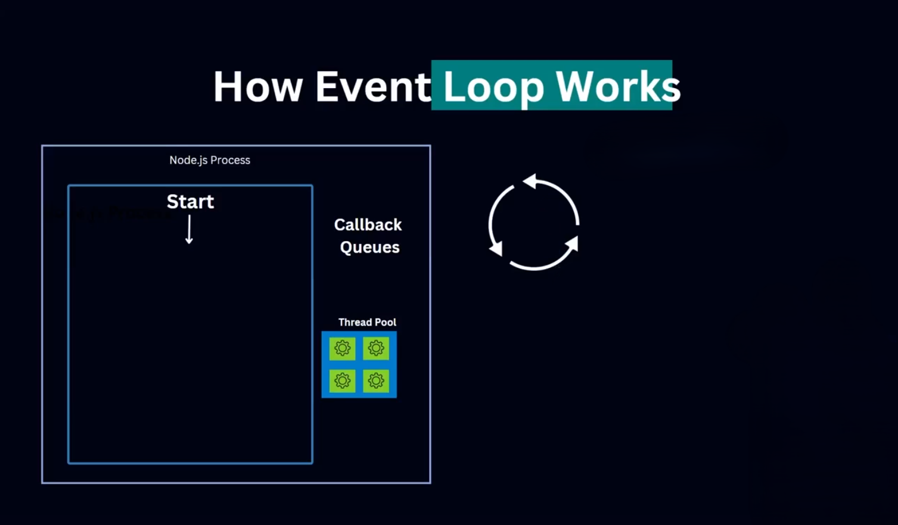
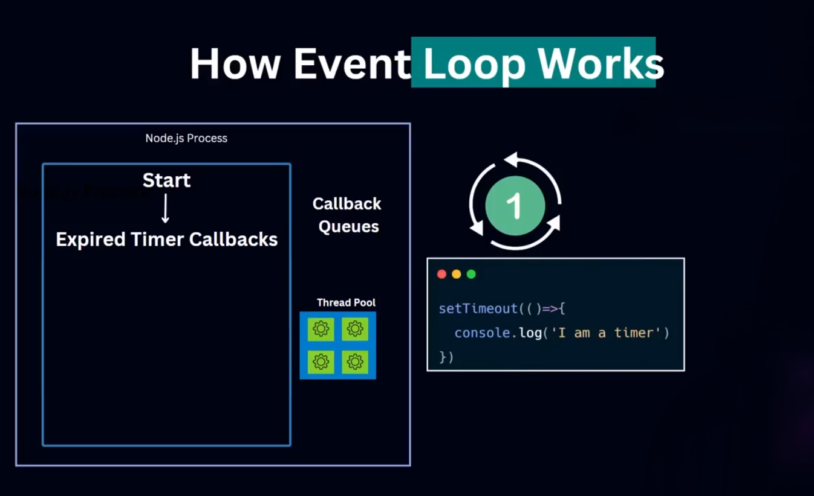
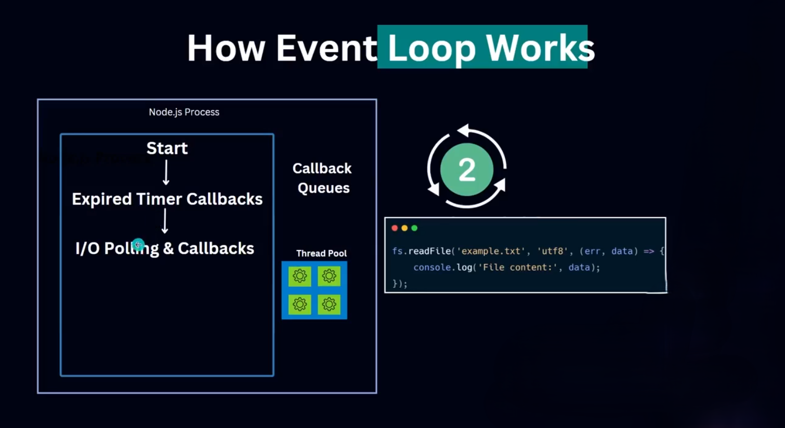
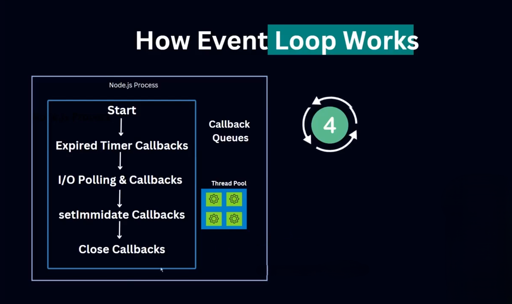
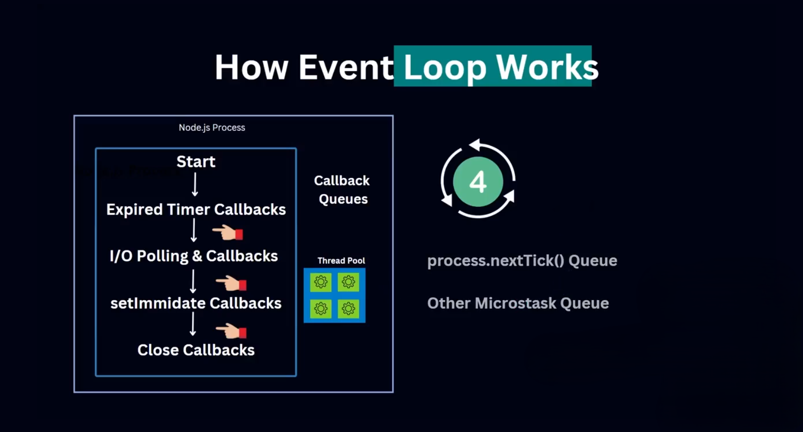
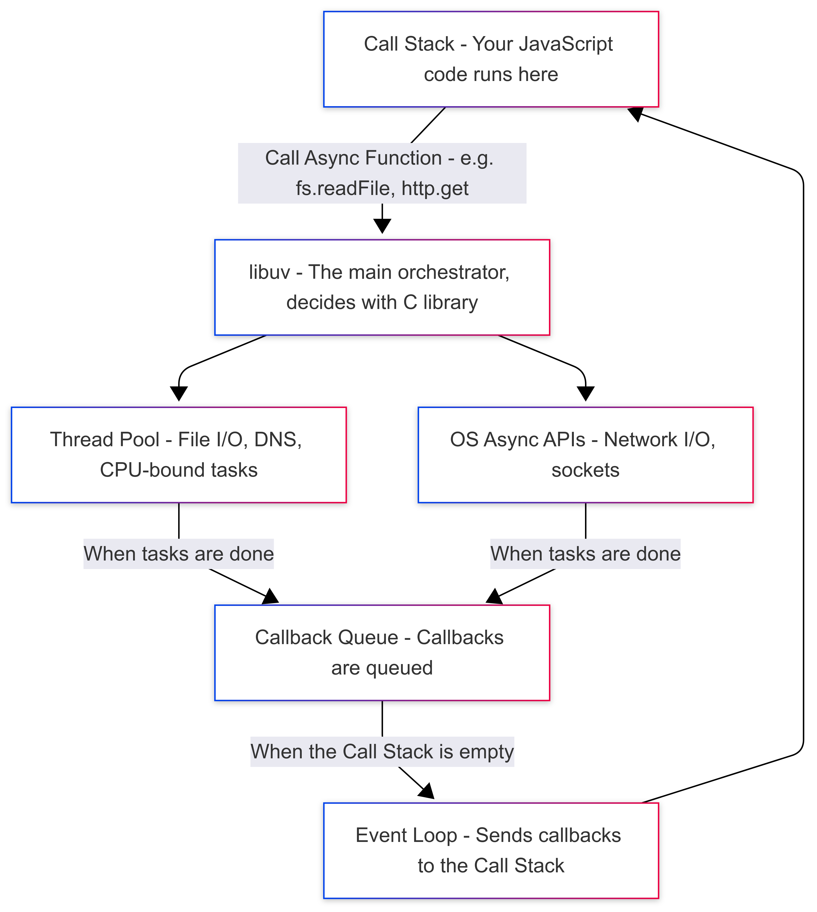

import { Steps } from 'nextra/components'


# How Event Loop works

## 🔄 Event Loop কীভাবে কাজ করে: ধাপে ধাপে ব্যাখ্যা

আমরা জানি, Node.js একটি **Single-threaded, Event-driven Architecture** অনুসরণ করে।

এই আর্কিটেকচারে দুই ধরণের কাজ দেখা যায়:

- I/O Intensive Tasks (যেমন: ফাইল পড়া, API কল)
- CPU Intensive Tasks (যেমন: heavy calculation)

Node.js এর **Single-threaded nature** থাকা সত্ত্বেও এই কাজগুলো ব্লক না করে **Thread Pool**-এ পাঠিয়ে দেয়। কাজ শেষ হলে রেজাল্ট পাঠানো হয় **Single Thread (Main Thread)**-এ, এবং Event Loop এটি প্রসেস করে ইউজারকে রেসপন্স পাঠিয়ে দেয়।

এই পুরো প্রসেস **Event Loop** দ্বারা পরিচালিত হয়, যা হলো Node.js এর হার্ট।

---

## 🕵️‍♂️ Event Loop: একটি নজরদারির মতো!

**Event Loop** এক ধরনের ওয়াচম্যানের মতো, যা ক্রমাগত পর্যবেক্ষণ করে:

- কোনো Event Trigger হলো কিনা
- কোনো Callback আসলো কিনা
- কখন, কিভাবে এবং কোন Callback প্রসেস করতে হবে

---

## 🔄 Event Loop এর ধাপসমূহ (Phases)

পুরো Event Loop এর Execution **৪টি প্রধান ফেজ** এ বিভক্ত:

<Steps>


<div className=' flex flex-col lg:flex-row justify-between gap-5 lg:gap-0 items-center'>

<div className=' w-full'>

### 🟢 **Start Phase** — Callback Queue তৈরি

- যখন কোনো Event Trigger হয় (যেমন: user input, setTimeout, API response),
- তখন একটি Callback Function তৈরি হয় এবং এটি **Callback Queue** তে যোগ হয়।
- এই Queue ই Event Loop এর সবচেয়ে গুরুত্বপূর্ণ অংশ।

❗ এছাড়াও, Event Loop এ আরও Queue থাকে:

**`process.nextTick()` Queue** এবং **`Microtask Queue`** — এদের আমরা পরে ব্যাখ্যা করবো।

</div>
---

<div className=' w-full'>



</div>
</div>
---

<div className=' flex flex-col lg:flex-row justify-between gap-5 lg:gap-0 items-center'>

<div className=' w-full'>

### 🕑 **Timer Phase** — `setTimeout` এবং `setInterval`

- Event Loop প্রথমে Timer Queue দেখে:
  কোনো `setTimeout()` বা `setInterval()` এর সময় শেষ হয়েছে কিনা।
- যদি হয়ে থাকে, তাহলে তার Callback Callback Queue তে চলে আসে এবং প্রসেস হয়।

🔺 Timer Callback গুলোর **Priority সবার উপরে** — কারণ এগুলো নির্দিষ্ট সময় পরে এক্সিকিউট হওয়া উচিত।

</div>
---

<div className=' w-full'>



</div>
</div>

---

<div className=' flex flex-col lg:flex-row justify-between gap-5 lg:gap-0 items-center'>

<div className=' w-full'>

### 💽 **I/O Callback Phase** — File, Network, DB Access

- এরপর Event Loop দেখে কোনো I/O Task (যেমন: File Read, HTTP Request) আছে কিনা।
- এগুলোর Callback গুলো তখন প্রসেস হয়।

📌 এই ধাপটি Node.js এর পারফর্মেন্সের মূল — কারণ I/O Task গুলোকে libuv ব্যাকগ্রাউন্ডে পাঠিয়ে দেয়, যাতে Main Thread ফ্রি থাকে।

</div>
---

<div className=' w-full'>



</div>
</div>

---

<div className=' flex flex-col lg:flex-row justify-between gap-5 lg:gap-0 items-center'>

<div className=' w-full'>

### ⚡ **setImmediate Phase** — Immediate Callback Execution

- এরপর Event Loop দেখে কোনো `setImmediate()` Callback আছে কিনা।
- এটি একটু বিশেষ, কারণ এটি current Polling phase শেষ হলেই দ্রুত এক্সিকিউট হয়।

🧠 Fun fact: এটি মূলত I/O Task complete হওয়ার পর Call Stack ফাঁকা হলেই আগেই এক্সিকিউট হয়।

</div>
---

<div className=' w-full'>

.png>)

</div>
</div>

---


<div className=' flex flex-col lg:flex-row justify-between gap-5 lg:gap-0 items-center'>

<div className=' w-full'>


### 🔒 **Close Callbacks Phase** — Resource Cleanup

- Event Loop শেষে দেখে কোনো Resource (যেমন: file/socket) বন্ধ হয়েছে কিনা।
- যদি হয়ে থাকে, তাহলে তার জন্য যে Callback আছে, সেটা এক্সিকিউট হয়।
</div>
--- 

<div className=' w-full'>




</div>
</div>


---
</Steps>

## 🧵 অতিরিক্ত Queue গুলো: Microtask & process.nextTick()

Event Loop এ শুধু Callback Queue-ই নেই — আরও দুটি বিশেষ Queue আছে:

| Queue                | Priority | ব্যাখ্যা                                             |
| -------------------- | -------- | ---------------------------------------------------- |
| `process.nextTick()` | সর্বোচ্চ | যে কোনো Callback শেষ হবার পরে বা তার মাঝখানে আগে চলে |
| Microtask Queue      | দ্বিতীয়  | `Promise.then()`, `queueMicrotask()` ইত্যাদি         |



### 🧠 গুরুত্বপূর্ণ:

এই Queue গুলো Event Loop এর phase এর **মাঝে মাঝেও** এক্সিকিউট হতে পারে।

তাই কখন কোনটা আগে চলবে — সেটা অনেক সময় **unpredictable** হয়ে যায়।

## ✅ সারসংক্ষেপ :

| ধাপ              | কী হয়                            |
| ---------------- | -------------------------------- |
| Start            | Callback Queue তৈরি হয়           |
| Timer            | setTimeout/setInterval এক্সিকিউট |
| I/O Callback     | File/Network কাজ প্রসেস          |
| setImmediate     | Immediate callback execute       |
| Close Callback   | Resource release এর callback     |
| Microtask Queue  | Promise, async-await এর কাজ      |
| process.nextTick | Highest priority callback        |

**ধাপসমূহ:**

```
১. JS Code → Call Stack
২. Async কাজ → Node APIs (libuv) → Thread Pool
৩. কাজ শেষ → Callback Queue-তে callback জমা হয়
৪. Event Loop → Stack খালি হলে callback এনে Stack-এ ঢোকায়
```

### 📉 Diagram:



---

## ✅ উপসংহার:

- Single-threaded সার্ভার একসাথে একটি কাজই করতে পারে, তাই I/O কাজ যদি block করে, সার্ভার আটকে যায়।
- Node.js smartly async কাজগুলো Thread Pool-এ পাঠিয়ে event loop দিয়ে Callback handle করে।
- এর ফলে Node.js অনেক request handle করতে পারে, এমনকি single-threaded হয়েও।

---
