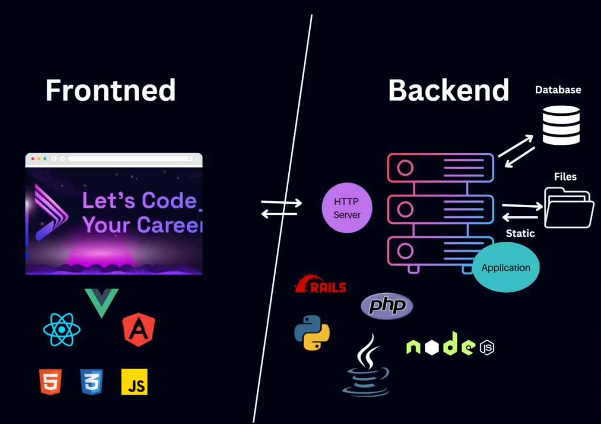

# Definition of Frontend & Backend
## 💻 ১. **ফ্রন্টএন্ড (Frontend) ও ব্যাকএন্ড (Backend) কী?**

### ✅ **ফ্রন্টএন্ড (Frontend):**

ফ্রন্টএন্ড হলো ওয়েবসাইটের সেই অংশ যা ব্যবহারকারীরা সরাসরি দেখে এবং ব্যবহার করে। উদাহরণ:

- হোমপেজ ডিজাইন
- বোতাম, মেনু, ফর্ম
- HTML, CSS, JavaScript ইত্যাদি ব্যবহার করে তৈরি হয়

🔹 জনপ্রিয় টুলস/ফ্রেমওয়ার্ক: **React.js, Vue.js, Angular**

---

### ✅ **ব্যাকএন্ড (Backend):**

ব্যাকএন্ড হলো ওয়েবসাইটের সেই অংশ যা ব্যবহারকারীরা দেখতে পায় না। এটি সার্ভারে চলে এবং ডেটা প্রসেস করে। উদাহরণ:

- ইউজার লগইন ভেরিফিকেশন
- ডেটাবেজে তথ্য রাখা/পড়া
- সার্ভার সাইড লজিক

🔹 জনপ্রিয় টেকনোলজি: **Node.js, Express.js, Django, PHP, MySQL, MongoDB** ইত্যাদি

### 🧠 ব্যাকএন্ড কীভাবে কাজ করে?

ব্যাকএন্ডে কিছু নির্দিষ্ট ফাইল থাকে যেগুলো নির্দিষ্ট রিকোয়েস্ট অনুযায়ী ক্লায়েন্ট সাইডে পাঠানো হয়। যখন ক্লায়েন্ট থেকে কোনো রিকোয়েস্ট আসে, তখন সার্ভার সেই রিকোয়েস্ট অনুসারে প্রয়োজনীয় ফাইলগুলো প্রসেস করে এবং ফ্রন্টএন্ডে পাঠায়।

এখানে শুধু সার্ভারই নয়, **ডেটাবেজ** নামের আরেকটি গুরুত্বপূর্ণ অংশ থাকতে পারে। সার্ভার তখন ডেটাবেজ থেকে ডেটা এনে প্রয়োজনমতো প্রসেস বা পরিবর্তন (transform) করে HTTP রিকোয়েস্ট অনুযায়ী ফ্রন্টএন্ডে পাঠায়।

এই প্রক্রিয়ায় **সার্ভার একটি মধ্যস্থতাকারীর (middleman)** মতো কাজ করে — ক্লায়েন্ট এবং ডেটাবেজ/সিস্টেমের মধ্যে যোগাযোগ ও লেনদেন নিশ্চিত করার জন্য।

এজন্যই ব্যাকএন্ডকে বলা হয় একটি "অ্যাপ্লিকেশন", কারণ এটি একাধিক কাজকে যুক্ত করে একটি পূর্ণাঙ্গ ব্যবস্থায় রূপ দেয়।

---