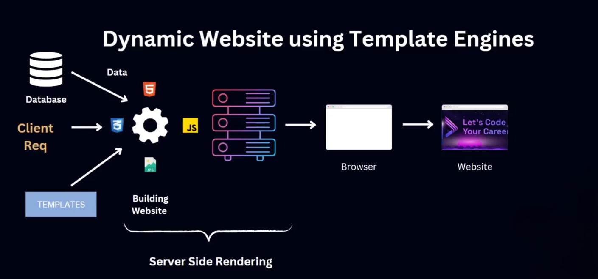
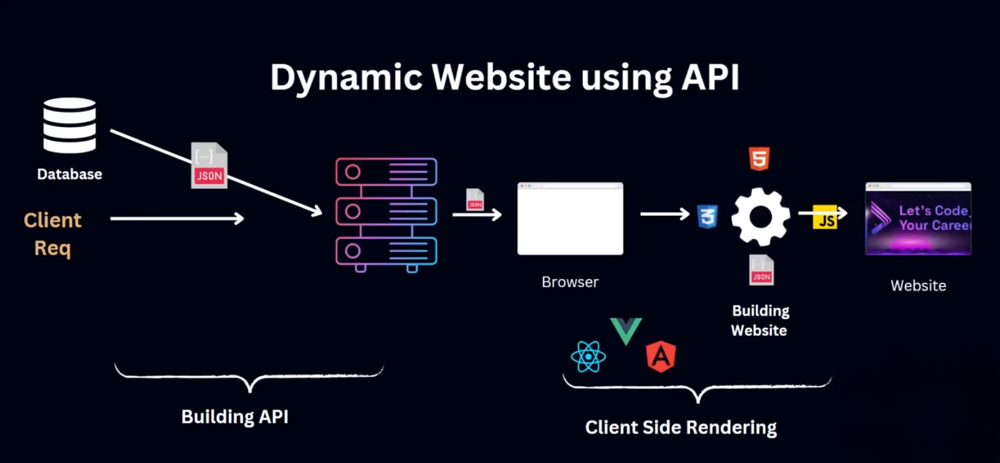

# SSR vs CSR
## 🌐 Server Side Rendering (SSR) ও Client Side Rendering (CSR)

ওয়েবসাইট তৈরির দুটি মূল উপায় রয়েছে — **Server Side Rendering (SSR)** ও **Client Side Rendering (CSR)**। এদের প্রতিটির নিজস্ব গঠন, উপকারিতা ও সীমাবদ্ধতা রয়েছে। নিচে এই দুটি টেকনিক নিয়ে বিস্তারিত আলোচনা করা হলো:

---

## 🖥️ Server Side Rendering (SSR)

Server Side Rendering বা SSR হল এমন একটি রেন্ডারিং প্রক্রিয়া যেখানে ওয়েবসাইটটি **সার্ভারে রেন্ডার** হয় এবং ব্যবহারকারী যখন একটি পেজ রিকোয়েস্ট করে তখন সার্ভারই HTML তৈরি করে ব্রাউজারে পাঠায়।

### 🏛️ প্রচলিত পদ্ধতিতে:

আগে ওয়েবসাইটগুলো সার্ভারে **টেমপ্লেট ইঞ্জিন** (যেমন: EJS, HUG ইত্যাদি) ব্যবহার করে তৈরি করা হতো। ব্যবহারকারী যখন কোনো পেজ রিকোয়েস্ট করতো, তখন সার্ভার ডেটাবেজ থেকে তথ্য নিয়ে সেই টেমপ্লেটে বসিয়ে পুরো HTML রেন্ডার করে পাঠিয়ে দিত।

### 🚀 আধুনিক SSR-এ:

বর্তমানে SSR করা হয় আধুনিক ফ্রেমওয়ার্ক ব্যবহার করে, যেমন:

- React
- Next.js
- Vue.js (Nuxt)
- Angular (Universal)

এসব ফ্রেমওয়ার্ক ডায়নামিক ইন্টারঅ্যাকশন যেমন: ফর্ম সাবমিট, হিস্টোরি ম্যানেজমেন্ট, ডেটা ফেচ ইত্যাদির জন্য **API বা সার্ভার লজিক** ব্যবহার করে।

### 🧷 CSS ও Media Load (SSR):

 সার্ভারটি একটি সম্পূর্ণ HTML পৃষ্ঠা তৈরি করে এবং পাঠায়, যার মধ্যে CSS ফাইল, মিডিয়া (যেমন ছবি) এবং জাভাস্ক্রিপ্টের লিঙ্ক অন্তর্ভুক্ত থাকে। যেহেতু সার্ভার থেকে HTML রেন্ডার করা হয়, তাই HTML-এর মধ্যে থাকা **CSS link ও `` tag সহ সব static asset (ছবি, ফন্ট, ইত্যাদি)** ব্রাউজার **প্রথম রেসপন্স পাওয়ার সাথেই** লোড করতে শুরু করে।

👉 অর্থাৎ SSR-এ CSS ও মিডিয়া ফাইল **তৎক্ষণাৎ ব্রাউজারে লোড** হতে থাকে, কারণ ব্রাউজার একবারেই পুরো HTML পাচ্ছে।

### ⚡ পারফরম্যান্স:

SSR পদ্ধতি তুলনামূলকভাবে দ্রুত হতে পারে কারণ ব্রাউজারে আলাদা করে DOM তৈরি করতে হয় না। সার্ভার থেকেই পুরো HTML রেন্ডার হয়ে আসে। ফলে পেজ **ফার্স্ট লোড টাইম** অনেক কম হয়।

---

## 🌐 Client Side Rendering (CSR)

Client Side Rendering বা CSR পদ্ধতিতে ওয়েবসাইটটি ব্রাউজারে রেন্ডার হয়। মানে, প্রথমে ব্রাউজারে শুধুমাত্র একটি বেসিক HTML, CSS, এবং JavaScript ফাইল পাঠানো হয়। এরপর JavaScript চালিয়ে DOM তৈরি হয় এবং পেজ দেখায়।

### 🛠️ ব্যবহৃত টুলস/ফ্রেমওয়ার্ক:

**React, Vue.js, Angular, Svelte** ইত্যাদি।

### 🔄 ডায়নামিক ফিচার যুক্ত করতে:

CSR-এ ওয়েবসাইটকে ডায়নামিক করতে হলে API কল ব্যবহার করে সার্ভার থেকে ডেটা আনা হয়। তারপর সেই ডেটা দিয়ে ব্রাউজার DOM তৈরি করে এবং রেন্ডার করে।

### 🧷 CSS ও Media Load (CSR):

CSR-এ প্রথমে শুধুই একটা basic HTML ফাইল লোড হয়, যেখানে `

` এর মতো placeholder থাকে। এরপর JavaScript ফাইল লোড হয়, যেটি DOM তৈরি করে এবং তারপরে CSS ও images লোড করা হয়।

👉 অর্থাৎ CSR-এ **CSS ও মিডিয়া লোড শুরু হয় JavaScript execution-এর পরে**, কারণ সেই সময়ে DOM তৈরি হয় এবং ব্রাউজার বুঝতে পারে কী কী asset দরকার।

### ⚠️ সীমাবদ্ধতা:

- প্রথম লোড সময় (Initial Load Time) বেশি হতে পারে কারণ JavaScript লোড না হলে পেজ কিছুই দেখাবে না।
- সার্চ ইঞ্জিন অপ্টিমাইজেশন (SEO) কিছুটা দুর্বল হতে পারে, যদিও এখন অনেক ফ্রেমওয়ার্ক এই সমস্যা কমিয়ে ফেলেছে।

---

## 🧩 SSR বনাম CSR: তুলনা

| বিষয় | SSR | CSR |
| --- | --- | --- |
| রেন্ডার কোথায় হয় | সার্ভারে | ক্লায়েন্ট (ব্রাউজার) এ |
| প্রথম লোড টাইম | তুলনামূলকভাবে দ্রুত | তুলনামূলকভাবে ধীর |
| ডায়নামিক ফিচার | সার্ভার লজিক/এপিআই | এপিআই কল ও ক্লায়েন্ট লজিক |
| CSS/Media Load | প্রথম HTML-এর মধ্যেই লোড শুরু হয় | JS এক্সিকিউশন এর পর লোড শুরু হয় |
| SEO সুবিধা | ভালো | তুলনামূলক কম |
| ব্যবহৃত টুলস | EJS, Next.js, Nuxt.js ইত্যাদি | React, Vue.js, Angular ইত্যাদি |

---

## ✅ স্ট্যাটিক ও ডায়নামিক ওয়েবসাইট — SSR বা CSR উভয়ই হতে পারে

যেকোনো ওয়েবসাইট, সেটা **স্ট্যাটিক** (পরিবর্তনহীন) হোক বা **ডায়নামিক** (ইউজার ইনপুট/ডেটাবেজ ভিত্তিক) — দুইভাবেই বানানো যেতে পারে:

- SSR ব্যবহার করে সার্ভার থেকে HTML সরবরাহ করে
- CSR ব্যবহার করে ব্রাউজারে JavaScript দিয়ে HTML তৈরি করে

---

## 📘 উপসংহার:

তোমার প্রকল্পের ধরন ও চাহিদার উপর নির্ভর করে SSR বা CSR যেকোনো একটি বেছে নেওয়া যায়।

- যদি চাইলে **দ্রুত লোড, SEO সুবিধা** — তবে SSR ভালো
- যদি চাইলে **রিচ ইন্টারঅ্যাকটিভ UI ও SPA টাইপ ফিচার** — তবে CSR ভালো

---