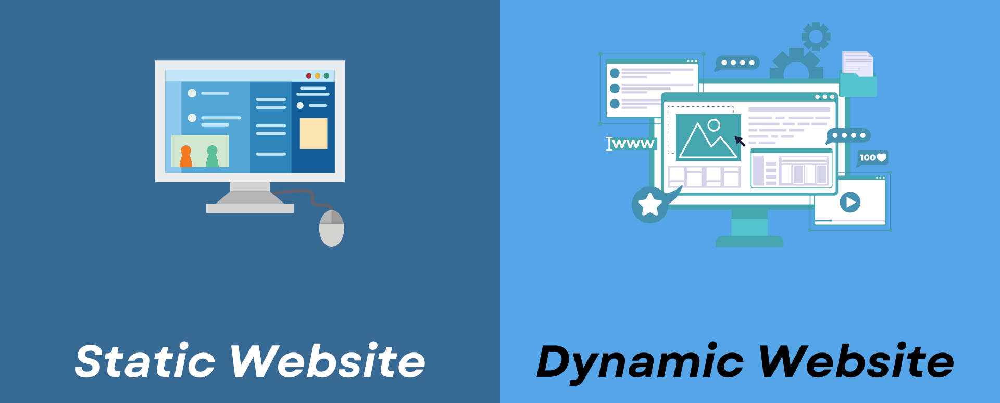

# Static & Dynamic website
## 🌐 **স্ট্যাটিক (Static) ও ডায়নামিক (Dynamic) ওয়েবসাইট কী?**

### 🧊 **স্ট্যাটিক ওয়েবসাইট:**

যেখানে প্রতিটি পেজ হাতে কোড করে বানানো হয় এবং সব ইউজারের জন্য একইরকম থাকে।

**🔹 বৈশিষ্ট্য:**

- HTML, CSS দিয়ে তৈরি
- কোনো সার্ভার বা ডেটাবেজ যুক্ত নেই
- দ্রুত লোড হয়
- পরিবর্তন করতে হলে কোড পরিবর্তন করতে হয়

**🔹 উদাহরণ:** পোর্টফোলিও সাইট, কোম্পানির তথ্য পেজ

---

### 🔄 **ডায়নামিক ওয়েবসাইট:**

যেখানে কন্টেন্ট ব্যবহারকারীর প্রয়োজন অনুযায়ী পরিবর্তন হয়। সার্ভার, ডেটাবেজ এবং প্রোগ্রামিং লজিক যুক্ত থাকে।

**🔹 বৈশিষ্ট্য:**

- Backend কোড, ডেটাবেজ ও ইউজার ইনপুট অনুযায়ী কনটেন্ট পরিবর্তন হয়
- ইউজার লগইন, পোস্ট করা, ডেটা সংরক্ষণ সম্ভব
- বানানো হয় Node.js, PHP, Python ইত্যাদি দিয়ে

**🔹 উদাহরণ:** Facebook, YouTube, E-commerce ওয়েবসাইট