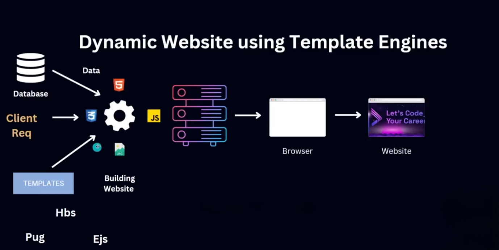
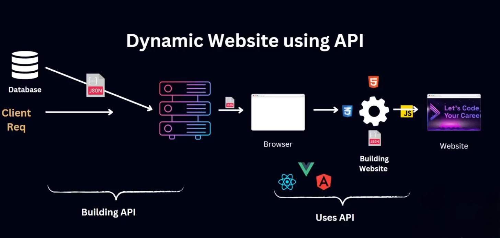

# Template Engine & API 
## 🧩 **টেমপ্লেট ইঞ্জিন ব্যবহার করে ডায়নামিক ওয়েবসাইট কীভাবে কাজ করে?**

**Template Engine** হলো এমন একটি টুল যা ডায়নামিক ডেটা (যেমন ডেটাবেজের তথ্য) HTML টেমপ্লেটের মধ্যে বসিয়ে রেন্ডার করে।

**🔹 কাজের ধাপ:**

1. সার্ভার থেকে ডেটা ফেচ করে
2. ডেটা টেমপ্লেট ফাইলে বসিয়ে HTML তৈরি করে
3. ইউজারের ব্রাউজারে সেই HTML পাঠায়

🔹 জনপ্রিয় টেমপ্লেট ইঞ্জিন:

- EJS, Handlebars, Pug (Node.js এ জনপ্রিয়)

**🔹 সুবিধা:**

- কোড পরিষ্কার থাকে
- Reusable কম্পোনেন্ট বানানো যায়
- ডায়নামিক ডেটা দেখানো সহজ হয়

---

## 🔗 **API ব্যবহার করে ডায়নামিক ওয়েবসাইট কীভাবে কাজ করে?**

**API (Application Programming Interface)** হলো এমন একটি ইন্টারফেস যার মাধ্যমে একটি অ্যাপ অন্য অ্যাপের সাথে ডেটা আদান-প্রদান করতে পারে।

**🔹 কাজের ধাপ:**

1. ইউজার ব্রাউজারে কোনো রিকোয়েস্ট করে (যেমন: ইউজার তালিকা দেখতে)
2. ফ্রন্টএন্ড → API → ব্যাকএন্ড থেকে ডেটা চায়
3. ব্যাকএন্ড ডেটা রিটার্ন করে (JSON ফরম্যাটে)
4. ফ্রন্টএন্ড সেই ডেটা দিয়ে UI রেন্ডার করে

**🔹 উদাহরণ:**

- Weather API, Google Maps API, News API

---

## ✅ ৫. **API ব্যবহারের উপকারিতা ও আধুনিক যুগে এর প্রয়োজনীয়তা**

### 🌟 উপকারিতা:

- আলাদা সিস্টেমের মধ্যে ডেটা বিনিময় সহজ
- একটি API দিয়ে মোবাইল অ্যাপ, ওয়েব অ্যাপ, ডেস্কটপ অ্যাপ—সব জায়গায় ব্যবহার করা যায়
- কোড রিপিটেশন কমে
- উন্নত পারফরম্যান্স ও রিয়েল টাইম ডেটা সম্ভব

### 🔥 আধুনিক যুগে প্রয়োজনীয়তা:

- Microservices আর্কিটেকচারে ব্যবহৃত হয়
- হেডলেস CMS ও JAMstack ওয়েবসাইটে জরুরি
- রিয়েল-টাইম অ্যাপ (চ্যাট, ট্র্যাকিং) তৈরি করতে API অপরিহার্য

.png)