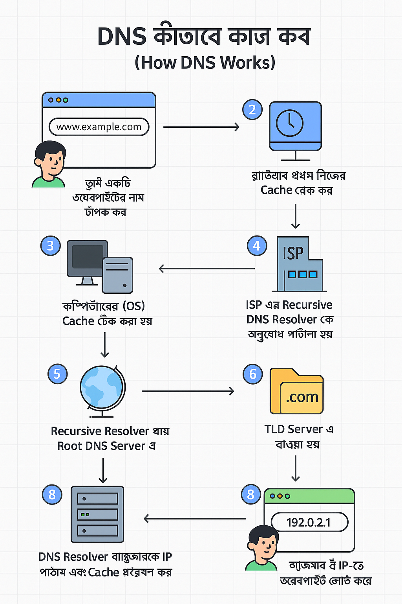

import Image from "next/image";
import img1 from "./screencapture-web-programming-hero-level2-batch-5-video-level2-batch-5-12-1-how-the-web-works-2025-06-09-10_06_49.png";
import img2 from "./screencapture-web-programming-hero-level2-batch-5-video-level2-batch-5-12-1-how-the-web-works-2025-06-09-10_04_17.png";

# How DNS Works

## 🌐 DNS কীভাবে কাজ কর

**DNS (Domain Name System)** হলো ইন্টারনেটের **ঠিকানা বই বা ফোনবুক**। যেমন, তুমি কারো নাম দিয়ে তার ফোন নম্বর খুঁজো, তেমনি DNS ডোমেইন নাম (যেমন `www.google.com`) কে একটি **IP ঠিকানায়** রূপান্তর করে দেয়, যাতে কম্পিউটারগুলো একে অপরের সাথে যোগাযোগ করতে পারে।

---

### 🧭 ধাপে ধাপে DNS কীভাবে কাজ করে:

1. **তুমি একটি ওয়েবসাইটের নাম টাইপ করো**
    
    উদাহরণ: `www.example.com`
    
2. **ব্রাউজার প্রথমে নিজের Cache চেক করে**
    
    যদি আগেই ওয়েবসাইটটি ভিজিট করা হয়ে থাকে, তাহলে ব্রাউজার তার স্মৃতি (cache) থেকে আইপি ঠিকানা নিয়ে নেয়।
    
3. **কম্পিউটারের (OS) Cache চেক করা হয়**
    
    ব্রাউজারে না থাকলে কম্পিউটার নিজস্ব ক্যাশে অনুসন্ধান করে।
    
4. **ISP এর Recursive DNS Resolver কে অনুরোধ পাঠানো হয়**
    
    কোনো cache-এ না থাকলে, DNS resolver (যেটা সাধারণত তোমার ISP দিয়ে থাকে) কে প্রশ্ন করা হয়:
    
    *"এই [www.example.com](http://www.example.com/) কোথায়?"*
    
5. **Recursive Resolver যায় Root DNS Server এ**
    
    এটি হলো ইন্টারনেটের প্রথম ধাপ। Root Server বলে দেয় — "এই ডোমেইনটি `.com` TLD-র মধ্যে পড়ে।"
    
6. **TLD (Top-Level Domain) Server এ যাওয়া হয়**
    
    `.com` সার্ভার জানায়, `example.com` কার আওতায় রয়েছে এবং এর Authoritative DNS Server কোথায়।
    
7. **Authoritative DNS Server থেকে সঠিক IP সংগ্রহ করা হয়**
    
    এই সার্ভার জানায় `www.example.com` এর জন্য আসল IP ঠিকানা কী।
    
    উদাহরণ: `192.0.2.1`
    
8. **DNS Resolver ব্রাউজারকে IP পাঠায় এবং ক্যাশে সংরক্ষণ করে**
    
    যেন ভবিষ্যতে আবার ব্যবহার করা হলে দ্রুত রেসপন্স দেওয়া যায়।
    
9. **ব্রাউজার ঐ IP-তে HTTP রিকোয়েস্ট পাঠায় এবং ওয়েবসাইট লোড করে**
    
    এখন তুমি ওয়েবসাইট দেখতে পারো! 
    
    
    

---

### 🔁 DNS Cache কিভাবে সাহায্য করে?

DNS সিস্টেমের প্রতিটি ধাপে তথ্য **ক্যাশে** রাখা হয় — যেমন:

- 🧠 ব্রাউজার ক্যাশে
- 💻 কম্পিউটার (OS) ক্যাশে
- 🌐 ISP এর DNS Resolver ক্যাশে

এই ক্যাশিং ব্যবস্থার জন্য একই ওয়েবসাইটে বারবার প্রবেশ করলে অনেক দ্রুত লোড হয়।

---

### 📌 সহজ উপমা:

> তুমি: "ভাই, www.google.com কোথায়?"
> 
> 
> **DNS:** "ঠিক আছে, আমি Root → .com → Google এর সার্ভারে খুঁজে দেখছি... পেয়ে গেলাম! ওটা আছে `142.250.190.36` এ।"
> 

---

  <Image
    src={img1}
    alt="Custom Image"
    height={100000}
    className="  w-full lg:w-[49%]"
  />
  ---
  <Image
    src={img2}
    alt="Custom Image"
    height={10000}
    className="  w-full lg:w-[49%]"
  />

---