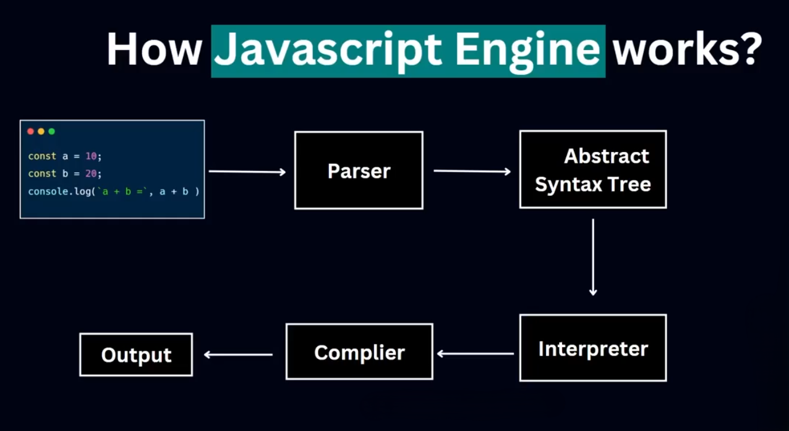
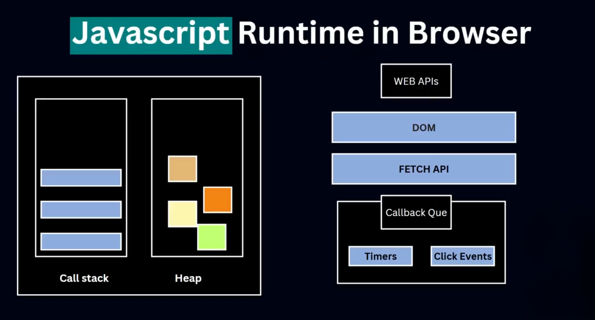

# JS working Process
### ⚙️ জাভাস্ক্রিপ্ট কীভাবে কাজ করে?

1. **Code Execution:**
    - ব্রাউজার HTML লোড করার সময় JS ফাইলও লোড করে।
    - JS Engine (যেমন V8) কোডকে পার্স করে → AST তৈরি করে → কম্পাইল করে → রান করে।
2. **Execution Context:**
    - JS কোড Execution Context তৈরি করে।
    - Stack (Call Stack), Heap Memory এবং Event Loop ব্যবহার করে।
3. **Single Threaded:**
    - JS মূলত এক থ্রেডে চলে।
    - কিন্তু **asynchronous** কাজের জন্য Event Loop + Callback Queue ব্যবহৃত হয়।
    
    
    
    
    

---

### 🚫 আগে কেন সার্ভারে জাভাস্ক্রিপ্ট ব্যবহার করা হতো না?

- JavaScript মূলত ব্রাউজার-ভিত্তিক ভাষা ছিল।
- সার্ভার-সাইডে ব্যবহৃত হতো PHP, Java, Python ইত্যাদি।
- JS এর কোন শক্তিশালী runtime environment ছিল না।
- JS ছিল slow এবং ব্রাউজার নির্ভর।

---