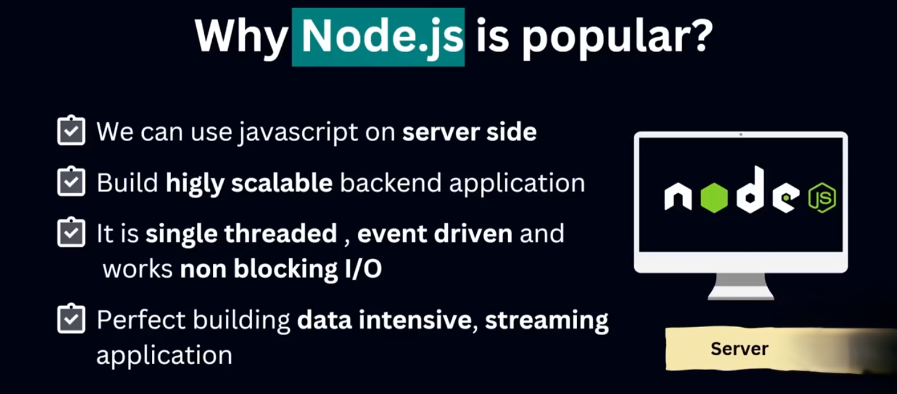
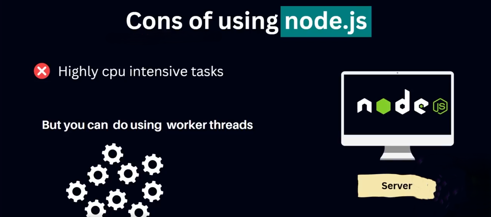
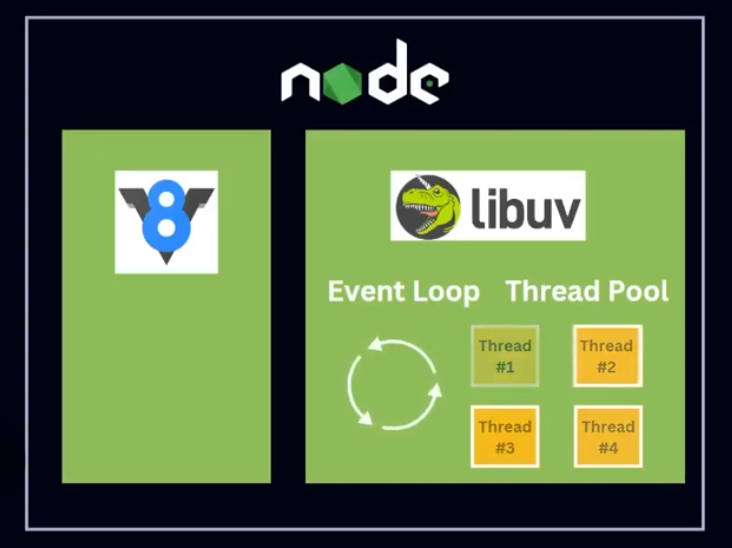
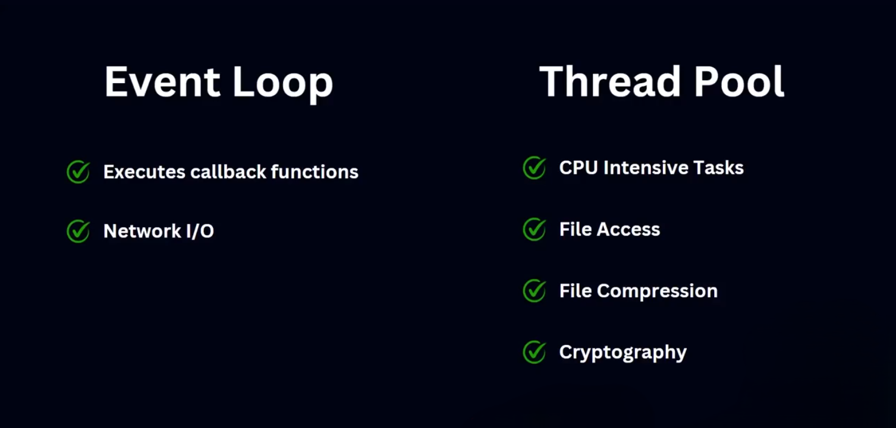

# Node.js Popularity & Dependencies
### 🚀 Node.js কেন জনপ্রিয়?

**✅ সুবিধা (Pros):**
- Non-blocking, asynchronous I/O → দ্রুত সার্ভার রেসপন্স।
- Single programming language (JS) for both client & server।
- প্রচুর মডিউল (NPM) ফ্রি পাওয়া যায়।
- Lightweight এবং scalable। 

---

**❌ অসুবিধা (Cons):**

- CPU-intensive কাজের জন্য উপযুক্ত নয়।
- Callback hell (যদি async কোড ভালোভাবে না লেখা হয়)।
- Single thread → একাধিক লোডে পারফর্মেন্স কমতে পারে।

--- 

 --- 

### 📦 Node.js এর নির্ভরতা (Dependencies):

1. **V8 Engine** – JS কোড রান করার জন্য।
2. **libuv** – Event loop এবং async I/O এর জন্য।
3. **http-parser, c-ares, OpenSSL, zlib** – সার্ভার সম্পর্কিত কাজের জন্য।

.png>)

---

### 🧠 V8 Engine এবং libuv ব্যাখ্যা:

### 🚂V8 Engine:

**Node.js এর runtime** মূলত **V8 Engine**-এর উপর ভিত্তি করে তৈরি, যা **C++ এবং JavaScript** দিয়ে তৈরি।

যদি V8 না থাকতো, তাহলে Node.js কখনোই JavaScript কোড বুঝতে পারত না।

তাই বলা যায়, **V8 হল Node.js এর সবচেয়ে গুরুত্বপূর্ণ ডিপেন্ডেন্সি**।

### 🧩 V8 Engine সম্পর্কে কিছু মূল পয়েন্ট:

- এটি **Google** তৈরি করেছে (C++ দিয়ে)।
- JavaScript কোডকে **Machine Code** এ রূপান্তর করে।
- এটি কাজ করে খুব দ্রুত, কারণ এটি **Just-In-Time (JIT) Compilation** ব্যবহার করে।
- **Google Chrome** ও **Node.js** — উভয়ই **V8 Engine** ব্যবহার করে।

### 🔁 libuv:

**libuv** একটি ওপেন সোর্স লাইব্রেরি, যা **C++** দিয়ে লেখা হয়েছে এবং Node.js এর নিচে কাজ করে।

এর মূল কাজ হলো **asynchronous I/O** হ্যান্ডেল করা এবং Node.js-কে **কম্পিউটারের OS, ফাইল সিস্টেম, নেটওয়ার্কিং** ইত্যাদিতে অ্যাক্সেস দেওয়া।

### ⚙️ libuv এর কাজগুলো:

- C++ দিয়ে তৈরি একটি লাইব্রেরি যা Node.js-এর বেস হিসেবে কাজ করে।
- **Event loop** চালিয়ে asynchronous কাজ যেমন ফাইল রিড/রাইট, নেটওয়ার্ক রিকোয়েস্ট ইত্যাদি হ্যান্ডেল করে।
- **Thread pool** ব্যবহার করে CPU-heavy টাস্কগুলো **parallel ভাবে** চালানোর চেষ্টা করে।
- Node.js-কে কম্পিউটার সিস্টেমের **ফাইল সিস্টেম, অপারেটিং সিস্টেম ও নেটওয়ার্কে অ্যাক্সেস** প্রদান করে।

.png>)

---

### 🧩 libuv এর গুরুত্বপূর্ণ ভূমিকা

**libuv** হল Node.js এর একটি মূল লাইব্রেরি যা দুইটি অত্যন্ত গুরুত্বপূর্ণ অংশ বাস্তবায়ন করে:

1. **Event Loop**
2. **Thread Pool**

--- 

---

### 🔁 Event Loop

**Event Loop** হচ্ছে এমন একটি প্রক্রিয়া, যা **V8 Engine**-এর সঙ্গে যুক্ত থেকে **Call Stack**-এ থাকা ফাংশনগুলো **manage** এবং **execute** করার কাজ করে।

যখন কোনো asynchronous কাজ থাকে, Event Loop সেটাকে ঠিকঠাকভাবে ট্র্যাক করে এবং কাজ শেষে সেটা Stack-এ ফেরত পাঠায়।

---

### 🧵 Thread Pool

**Thread Pool** মূলত ব্যবহার হয় সেই কাজগুলোতে যেগুলো **CPU-intensive** বা **heavy computation**-এর প্রয়োজন হয়।

আমরা জানি, Node.js একক থ্রেডে চলে — তাই এমন জটিল কাজ গুলো ক্লাসিকভাবে করা যেত না।

**libuv এর Thread Pool** এই সীমাবদ্ধতাকে কাটিয়ে **Node.js কে parallelভাবে কাজ করার সুযোগ দেয়**।

---

---
