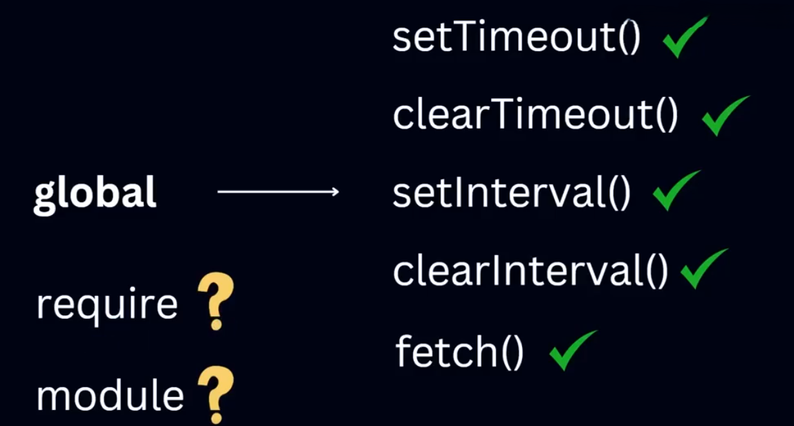

# Browser vs Node.js & IIFE
## 🌐 গ্লোবাল অবজেক্ট: ব্রাউজার বনাম Node.js

জাভাস্ক্রিপ্ট চালানোর সময় আমরা নির্দিষ্ট কিছু গ্লোবাল অবজেক্টের অ্যাক্সেস পাই। এই গ্লোবাল অবজেক্টগুলো প্ল্যাটফর্ম ভেদে আলাদা হতে পারে — যেমন: ব্রাউজারে আমরা `window` অবজেক্ট পাই এবং Node.js-এ পাই `global` অবজেক্ট।

---

.png)

## 🧭 ব্রাউজারে গ্লোবাল অবজেক্ট (`window`)

যখন আমরা ব্রাউজারে জাভাস্ক্রিপ্ট চালাই, তখন আমরা `window` অবজেক্টের মাধ্যমে অনেক বিল্ট-ইন মেথড ও প্রপার্টির অ্যাক্সেস পাই:

```jsx
console.log(window);
```

📌 **উদাহরণ:**

```jsx
setTimeout(() => {
  console.log("Hello from browser!");
}, 1000);

fetch("https://jsonplaceholder.typicode.com/todos/1")
  .then(response => response.json())
  .then(json => console.log(json));
```

🔍 `setTimeout()` এবং `fetch()` এই দুটি ফাংশনই `window` অবজেক্টের অংশ।

---

## 🖥️ Node.js-এ গ্লোবাল অবজেক্ট (`global`)

Node.js-এ ব্রাউজারের মতো `window` অবজেক্ট নেই, কিন্তু `global` নামে একটি অবজেক্ট থাকে যেটা একই উদ্দেশ্যে কাজ করে:

```jsx
console.log(global);
```

📌 **উদাহরণ:**

```jsx
setTimeout(() => {
  console.log("Hello from Node.js!");
}, 1000);
```



⚠️ **Note:** Node.js-এ `require`, `module`, `__dirname`, `__filename` ইত্যাদি `global` অবজেক্টের অংশ না — এগুলো `Node.js` এর নিজস্ব মডিউল সিস্টেম থেকে পাওয়া যায়।

---

## 🛡️ Node.js কোডের গোপন রহস্য — IIFE

Node.js যখন কোনো `.js` ফাইল রান করে, তখন সে পুরো ফাইলটাকে একটা **IIFE** (Immediately Invoked Function Expression)-এর ভেতর রেখে রান করে।

```jsx
(function(exports, require, module, __filename, __dirname) {
  // আমাদের লেখার কোড এখানেই চলে
})();
```

🎯 **কারণ:**

- কোড আলাদা scope-এ থাকে (গ্লোবাল স্কোপ পলিউট হয় না)
- প্রতিটি মডিউল নিজস্বভাবে isolate থাকে

---

## ⚡ IIFE (Immediately Invoked Function Expression)

**সংজ্ঞা:**

IIFE হলো এমন একটি ফাংশন যেটিকে ডিফাইন করার সাথেসাথে কল করে ফেলা হয়। এটা সাধারণত স্কোপ isolate রাখতে বা এক্সিকিউশনের সময় কিছু variable/private context তৈরি করার জন্য ব্যবহৃত হয়।

### 🧪 উদাহরণ:

```jsx
(function() {
  const secret = "hidden";
  console.log("IIFE executed");
})();
```

🔐 এখানে `secret` নামক ভ্যারিয়েবলটি বাইরের কোনো স্কোপে অ্যাক্সেসযোগ্য নয়।

---

## ✅ উপসংহার

- 🪟 ব্রাউজারে `window`, 🖥️ Node.js-এ `global`
- 🧰 `setTimeout`, `setInterval` — দুই প্ল্যাটফর্মেই গ্লোবালি অ্যাক্সেসযোগ্য
- 📦 `require`, `module` ইত্যাদি Node.js-এর নিজস্ব scope-এ থাকে
- 🧪 Node.js পুরো কোড IIFE-র ভেতরে চালায় যাতে করে scoped execution সম্ভব হয়

এই জ্ঞানের মাধ্যমে তুমি সহজেই বুঝতে পারবে কোন প্ল্যাটফর্মে কীভাবে execution হয় এবং কেন কিছু জিনিস globally পাওয়া যায় আবার কিছু পাওয়া যায় না।