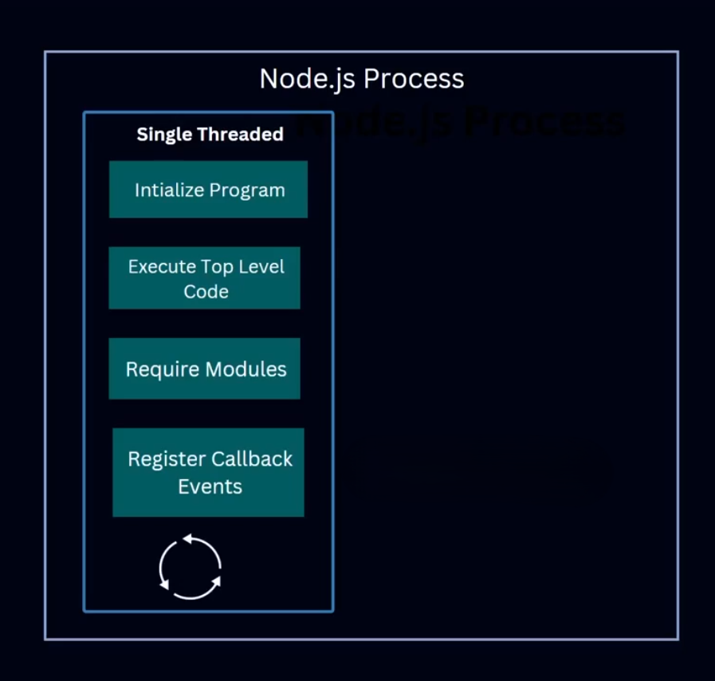

# 🔁 Single Threaded Execution (Node.js এ কীভাবে কাজ করে):

1. প্রথমে কোড initialize হয়।
2. Top-level কোড (main function-এর বাইরের কোড) execute হয়।
3. External module গুলো import করা হয়।
4. Callback বা Event গুলো **register** করা হয়, কিন্তু তখনই execute হয় না।
5. এরপর **Event Loop** শুরু হয়, যা registered callback গুলো পর্যায়ক্রমে execute করে।



---

### ⚙️ কিন্তু যদি কোন Callback ভারী কাজ হয়?

- যেমন: File read, Crypto calculation, Image processing...
- তখন Node.js সেই ভারী কাজগুলোকে **Thread Pool** এ পাঠিয়ে দেয়।
- এই Thread Pool হলো একগুচ্ছ Worker Thread যেগুলো ওই ভারী Task গুলো handle করে।
- কাজ শেষ হলে তারা Event Loop কে জানায়, তারপর Event Loop Output দেখায়।

.png)

---

### 🎯 সারাংশ:

- Process-এর ভিতরে ছোট execution units হলো → **Threads**
- **Node.js** এ main thread একটাই → **Single Thread**
- ভারী কাজগুলো জন্য থাকে **Thread Pool**
- সব কিছুর সমন্বয় করে **Event Loop** → তাই একে বলে **Event Driven Architecture**
- Node.js একক Thread-এ চলে → Single-threaded।
- কিন্তু Node.js **libuv** এর মাধ্যমে **Thread Pool** ব্যবহার করে।

### 🔧 Internal Thread Pool:

Node.js asynchronous কাজ (যেমন file system, DNS lookup ইত্যাদি) পরিচালনার জন্য background এ thread pool ব্যবহার করে।

```jsx
// File read with thread pool
const fs = require('fs');
fs.readFile('data.txt', (err, data) => {
  console.log("File read done");
});
```

👉 File read হলে libuv Thread Pool-এ চলে যায়, আর callback পরে Event Loop এ ফিরে আসে।

### 🚨 Single Threaded Architecture এর Downside

ধরো, আমাদের একটি Node.js সার্ভার আছে — যেটি single-threaded।

এখন একে একে ৪ জন ইউজার নিচের রিকোয়েস্টগুলো পাঠাচ্ছে:

1. 🧑‍💻 **User 1**: ডেটা রিকোয়েস্ট করছে (সহজ কাজ)
2. 🧑‍💻 **User 2**: একটি বড় ফাইল **synchronously** পড়তে চাচ্ছে (ভারি কাজ)
3. 🧑‍💻 **User 3**: Database query করছে
4. 🧑‍💻 **User 4**: আরও একটি ডেটা রিকোয়েস্ট করছে


---

### ⚙️ এখন কী ঘটবে?

- **User 1** এর রিকোয়েস্ট খুব সহজ, সেক্ষেত্রে Node.js একে সহজেই serve করে দিবে।

- তারপর **User 2** একটি **synchronous file read** করতে চাচ্ছে।

> ✅ কিন্তু সমস্যা এখানে! Synchronous মানেই এক কাজ শেষ না হলে পরের কাজ শুরু হবে না।
> 

এখন, যেহেতু **file read** একটা **heavy task**, এবং সেটা **synchronously** হচ্ছে, তাই:

- পুরো thread ঐ কাজেই আটকে থাকবে।
- **User 3** ও **User 4**এর রিকোয়েস্ট **ব্লক** হয়ে যাবে।
- ফাইল যত বড়, অপেক্ষার সময় তত বেশি।

এটাই হচ্ছে **Single Threaded Architecture**-এর বড় একটা **disadvantage**।

.png)

---

### 🛠️ সমাধান কী?

এই সমস্যার সমাধান দেয় **Thread Pool + Asynchronous Programming**।

### যদি **User 2** ফাইলটা **asynchronously** পড়তো তাহলে:

1. Node.js সেই ভারী কাজটা **Thread Pool**এ পাঠিয়ে দিতো।
2. Thread Pool ব্যাকগ্রাউন্ডে কাজ করতো।
3. **Event Loop** meanwhile অন্য ইউজার (**User 3 & 4**) এর রিকোয়েস্ট প্রসেস করতো।
4. কাজ শেষ হলে Thread Pool Event Loop কে জানাতো।
5. তারপর Event Loop **User 2**কে তার ফাইল রেসপন্স পাঠিয়ে দিতো।

.png)

---

### 🔁 Event Driven Architecture এর সৌন্দর্য

👉 Node.js একটাই থ্রেড ব্যবহার করেও —

**Asynchronous 방식ের মাধ্যমে ভারী Task গুলোকে smartly handle করে।**

- কেউ **Synchronous** request পাঠালে পুরো সার্ভার আটকে যেতে পারে। কিন্তু **Asynchronous** হলে, কাজ গুলো back-end এ ভাগ করে দেওয়া হয়।
- এতে করে কেউ ব্লক হয় না, এবং সার্ভার পারফরম্যান্সও কমে না।

---

### ✅ সারসংক্ষেপে:

- Synchronous ভারী কাজগুলো Single Thread ব্লক করে।
- Asynchronous + Thread Pool ব্যবহার করে সেই সমস্যা সমাধান করা যায়।
- এটাই Node.js-এর **Event Driven, Non-blocking Architecture**।

---

## ✅ উপসংহার:

| বিষয় | ব্যাখ্যা |
| --- | --- |
| Node.js Architecture | Event-driven, Non-blocking |
| Event Loop | Stack খালি থাকলে Callback Queue থেকে ফাংশন নেয় |
| Process | পুরো Node.js অ্যাপের runtime |
| Thread | Process এর মধ্যে execution units; Node.js ব্যাকগ্রাউন্ডে multiple thread ব্যবহার করে |