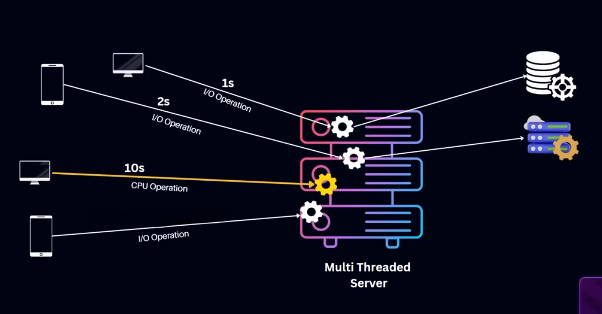
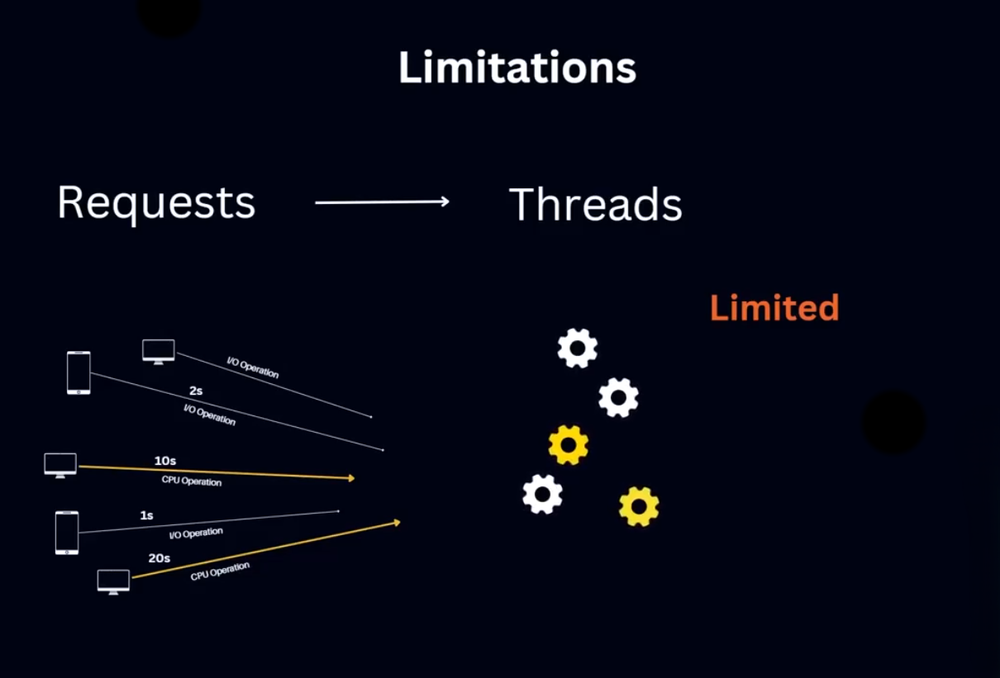
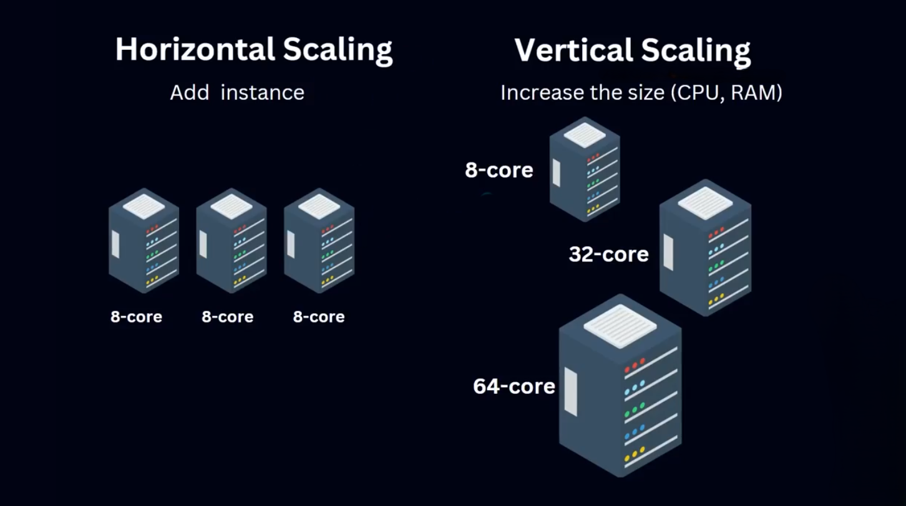
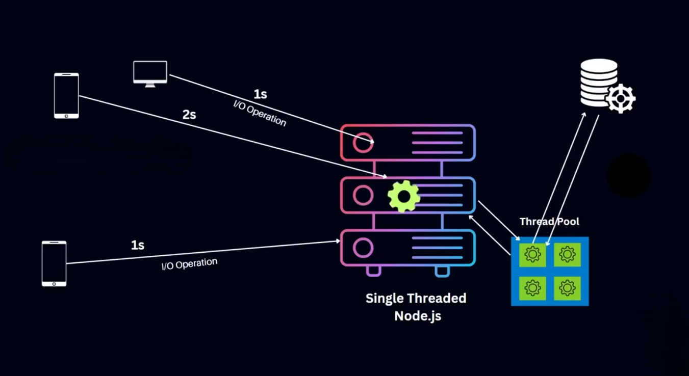
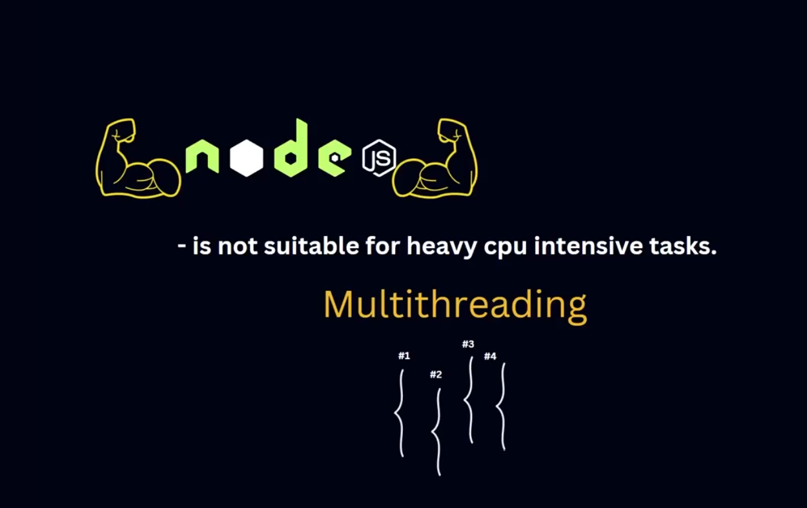
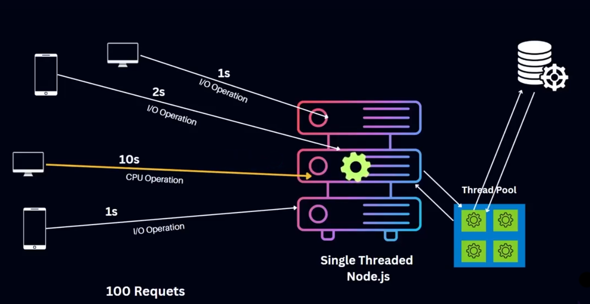

# Multi-threaded Server vs Single-threaded

## 🧵 Multi-threaded Server

**Multi-threaded Server**-এ একাধিক থ্রেড একসাথে কাজ করতে পারে, যার ফলে:

- একাধিক রিকোয়েস্ট সমান্তরালে প্রসেস হয়।
- সার্ভারের পারফর্মেন্স অনেক বেড়ে যায়।

### ✨ সমস্যা

এই আর্কিটেকচার কনকারেন্ট প্রসেসিং-এর কারণে কিছু জটিলতা তৈরি করে:

- `Deadlock`
- `Race condition`

### **উদাহরণ:**

ধরা যাক, আমাদের সার্ভারে ১০টি থ্রেড আছে। 

তাহলে একসাথে ১০টি ইউজারের রিকোয়েস্ট সহজেই প্রসেস করা যাবে, সেটা I/O operation হোক বা CPU intensive কাজ হোক না কেন। 

কিন্তু যখন ১১তম রিকোয়েস্ট আসবে, তখন সেটা **wait** করতে হবে — অর্থাৎ **block** হয়ে যাবে।

### এই সমস্যা সমাধানে দুটি স্কেলিং পদ্ধতি রয়েছে:

| Scaling | ব্যাখ্যা |
| --- | --- |
| 🔁 Horizontal Scaling | নতুন সার্ভার যুক্ত করে সামর্থ্য বাড়ানো হয় |
| ⬆️ Vertical Scaling | একই সার্ভারে শক্তিশালী CPU/GPU সংযুক্ত করা হয় |

❗ **দুই পদ্ধতিই ব্যয়বহুল এবং রিসোর্স-নির্ভর।** সবসময় স্কেলেবল নাও হতে পারে।

---

## 🪶 Single-threaded Server

**Single-threaded Server**-এ একটিই থ্রেড থাকে। এর বৈশিষ্ট্য:

- একসাথে একটি কাজই প্রসেস করা যায়।
- তবে এটি সহজ ও Lightweight, কারণ থ্রেড ম্যানেজমেন্ট কম লাগে।

### ✅ উদাহরণ: Node.js

- **Single-threaded + Event-driven**
- ভারী কাজ `libuv` এর **Thread Pool** দিয়ে হ্যান্ডেল করে।
- তাই একমাত্র থ্রেড ব্লক হয় না।

---

## ✅ Node.js এর সমাধান: Thread Pool + Event-driven Architecture

আগে Node.js-এ **CPU-intensive কাজ** করা কঠিন ছিল, কারণ একমাত্র থ্রেড ব্লক হয়ে যেত।

এখন, **Thread Pool** ব্যবহার করে ভারী কাজগুলো Worker Thread-এ পাঠানো হয় এবং Event Loop ফ্রি থাকে।

### 🔥 ফলাফল:

- **High concurrency**
- **Efficient performance**
- **Cost-effective** compared to traditional scaling

---

### 🧵 তুলনা: Single-threaded vs Multi-threaded Server :

| বিষয় | Single-threaded Server | Multi-threaded Server |
| --- | --- | --- |
| থ্রেড সংখ্যা | ১টি থ্রেড | একাধিক থ্রেড |
| প্রসেসিং ক্ষমতা | একসাথে একটি কাজ | একাধিক কাজ সমান্তরালে |
| পারফর্মেন্স | তুলনামূলক কম | বেশি |
| জটিলতা | সহজ | Concurrency হ্যান্ডেল করতে হয় |
| Node.js উপযোগিতা | ✔️ হ্যাঁ | ❌ সরাসরি নয় (কিন্তু ব্যাকগ্রাউন্ডে Thread Pool ব্যবহার করে) |

---