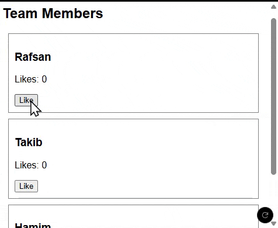

# 1. Component

---

**Component** হচ্ছে React UI বানানোর **building block**।

একটি Component সাধারণত একটি function আকারে তৈরি হয় এবং সেটি বারবার ব্যবহার করা যায়।

### **Component তৈরির নিয়ম:**

1. একটি নাম দেওয়া function লিখতে হবে (প্রথম অক্ষর অবশ্যই Capital হতে হবে)।
2. `export default` ব্যবহার করে export করতে হবে।
3. Component এর ভিতরে **JSX (JavaScript XML)** থাকতে হবে।

```jsx
function Profile() {
  return <h1>Hello, আমি একটি Component</h1>;
}

export default Profile;
```

## React Component পুনরায় ব্যবহারযোগ্যতা ও State ব্যবস্থাপনা :

React-এ আমরা একটি Component একবার তৈরি করেই সেটিকে বারবার ব্যবহার করতে পারি। এটা Component ভিত্তিক ডিজাইনের একটি বড় সুবিধা।

অন্যদিকে, JavaScript-এ যদি একই রকম কোনো UI বা লজিক দ্বিতীয়বার ব্যবহার করতে চাই, তাহলে প্রতিবার নতুন করে সেই অংশের জন্য আলাদা করে আইডেন্টিফিকেশন, DOM ম্যানিপুলেশন এবং লজিক তৈরি করতে হয়।

কিন্তু React-এ এই কাজটা অনেক সহজ — কারণ React প্রতিটি Component-এর জন্য নিজস্ব **unique identification** বা শনাক্তকারী নিজেই হ্যান্ডেল করে।

👉 আমরা শুধুমাত্র Component-এর নাম দিয়ে যেখানেই দরকার সেখানে কল করে ফেলতে পারি।

আর যখন UI আপডেট করতে হয়, তখন পুরো Component-টা ম্যানুয়ালি পরিবর্তন না করে শুধুমাত্র **state change** করলেই React স্বয়ংক্রিয়ভাবে UI আপডেট করে ফেলে।

### উদাহরণ: React Component বারবার ব্যবহার ও State দিয়ে UI আপডেট

---

```jsx
import React, { useState } from "react";

// একটি পুনরায় ব্যবহারযোগ্য Component
function ProfileCard({ name }) {
  const [likes, setLikes] = useState(0);

  return (
    <div style={{ border: "1px solid gray", padding: "10px", margin: "10px" }}>
      <h3>{name}</h3>
      <p>Likes: {likes}</p>
      <button onClick={() => setLikes(likes + 1)}>Like</button>
    </div>
  );
}

// মেইন App Component
export default function App() {
  return (
    <div>
      <h2>Team Members</h2>
      <ProfileCard name="Rafsan" />
      <ProfileCard name="Takib" />
      <ProfileCard name="Hamim" />
    </div>
  );
}
```



### 🔍 ব্যাখ্যা :

---

- আমরা একটা `ProfileCard` Component বানিয়েছি যেটা props দিয়ে নাম নেয় এবং state দিয়ে likes কাউন্ট করে।
- App Component-এ আমরা এই `ProfileCard` Component তিনবার ব্যবহার করেছি ভিন্ন ভিন্ন নাম দিয়ে।
- প্রতিটি `ProfileCard` নিজের state নিয়ে কাজ করে — মানে `Like` বাটনে ক্লিক করলে শুধু সেই নির্দিষ্ট কার্ডের `Likes` বাড়ে, অন্যগুলো অপরিবর্তিত থাকে।
- এখানে আমরা বারবার Component কল করেছি কিন্তু React নিজেই internal ভাবে প্রতিটির জন্য আলাদা identification তৈরি করেছে।
