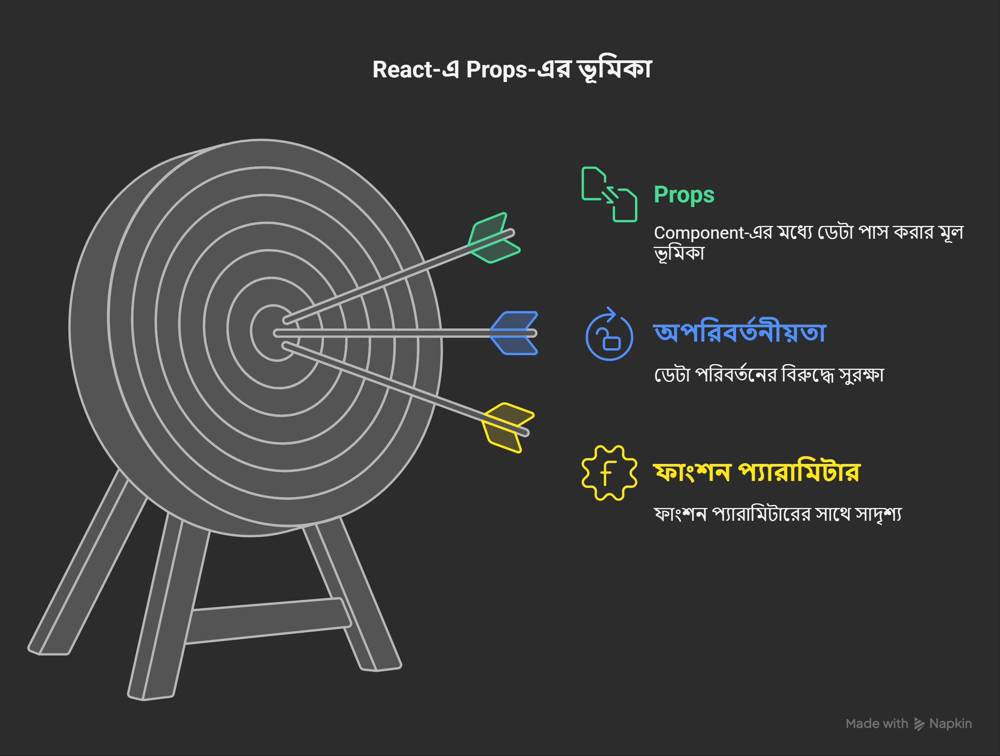

# 2. Props

---

**Props** হলো **Properties**, যেগুলো Component-এর মধ্যে data পাঠানোর জন্য ব্যবহার করা হয়। Props immutable অর্থাৎ এগুলো পরিবর্তন করা যায় না।

### 🔧 Props-এর বৈশিষ্ট্য



### সাধারণ পদ্ধতি vs Destructuring পদ্ধতি

---

### 🧑‍💻 সাধারণ পদ্ধতি:

```jsx
function Profile(props) {
  return (
    <div>
      <h2>নাম: {props.name}</h2>
      <p>বয়স: {props.age}</p>
    </div>
  );
}
```

### 🔥 Destructuring পদ্ধতি:

```jsx
function Profile({ name, age }) {
  return (
    <div>
      <h2>নাম: {name}</h2>
      <p>বয়স: {age}</p>
    </div>
  );
}
```

### 🧠 ব্যাখ্যা:

- উপরের উদাহরণে আমরা `props` নামক object এর ভেতর থেকে সরাসরি `name` এবং `age` কে **destructuring** করে নিয়েছি।
- এর ফলে কোডটি আরও পরিষ্কার, ছোট এবং বুঝতে সহজ হয়েছে।
