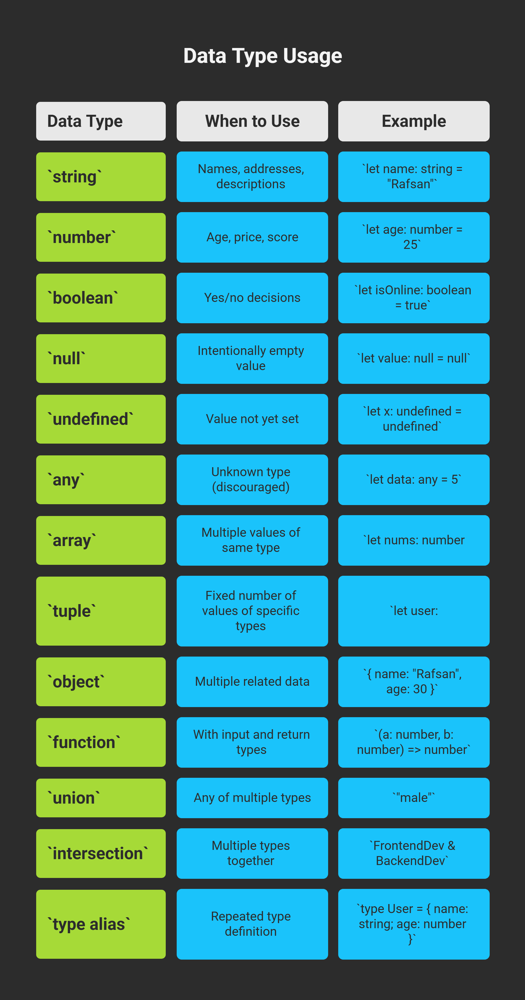

## 📊 টেবিল: কোন টাইপ কবে ব্যবহার করবেন

| ডেটা টাইপ      | কবে ব্যবহার করবেন                 | উদাহরণ                                      |
| -------------- | --------------------------------- | ------------------------------------------- |
| `string`       | নাম, ঠিকানা, বিবরণ ইত্যাদি        | `let name: string = "Rafsan"`               |
| `number`       | বয়স, দাম, স্কোর ইত্যাদি           | `let age: number = 25`                      |
| `boolean`      | হ্যাঁ/না সিদ্ধান্ত                | `let isOnline: boolean = true`              |
| `null`         | ইচ্ছাকৃত খালি মান                 | `let value: null = null`                    |
| `undefined`    | এখনও মান সেট হয়নি                 | `let x: undefined = undefined`              |
| `any`          | টাইপ অজানা (নিরুৎসাহিত)           | `let data: any = 5`                         |
| `array`        | একই টাইপের একাধিক মান             | `let nums: number[] = [1, 2, 3]`            |
| `tuple`        | নির্দিষ্ট ধরনের ফিক্সড সংখ্যক মান | `let user: [string, number]`                |
| `object`       | একাধিক সম্পর্কিত ডেটা             | `{ name: "Rafsan", age: 30 }`               |
| `function`     | ইনপুট ও রিটার্ন টাইপ সহ           | `(a: number, b: number) => number`          |
| `union`        | একাধিক টাইপে যেকোনো একটি          | `"male"                                     |
| `intersection` | একাধিক টাইপ একত্রে                | `FrontendDev & BackendDev`                  |
| `type alias`   | পুনরাবৃত্ত টাইপ সংজ্ঞায়ন          | `type User = { name: string; age: number }` |

