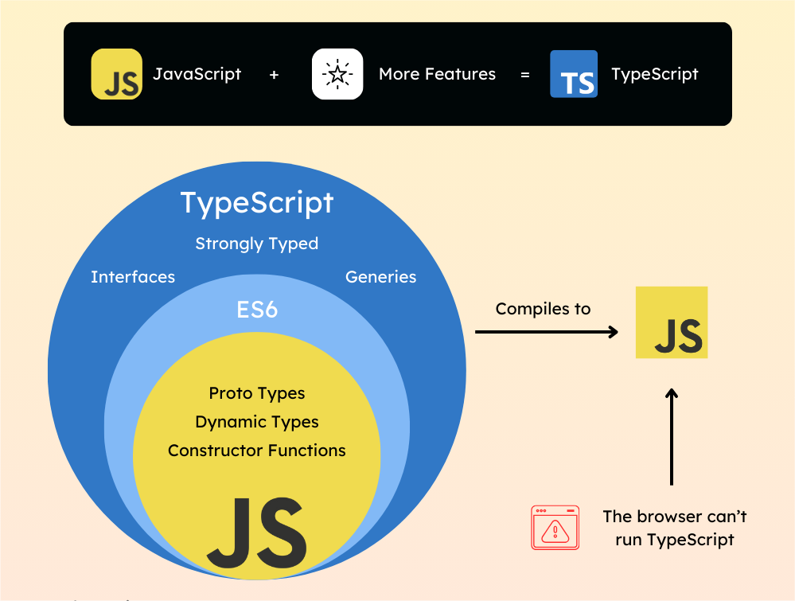

## টাইপস্ক্রিপ্ট (TypeScript) কী?

import { Callout } from 'nextra/components';
import Image from 'next/image';
import img2 from './Diagrams-1.jpg';
import img1 from './0ufu1q21.js-ts.png';

টাইপস্ক্রিপ্ট একটি অবজেক্ট ওরিয়েন্টেড প্রোগ্রামিং ভাষা, যা জাভাস্ক্রিপ্টের (JavaScript) উপর ভিত্তি করে তৈরি অর্থাৎ JavaScript-এ যা কিছু রয়েছে, সব TypeScript-এও পাওয়া যায়, তবে এতে অতিরিক্ত কিছু ফিচার যুক্ত করা হয়েছে। টাইপস্ক্রিপ্টে _static typing_ সাপোর্ট রয়েছে, অর্থাৎ আপনি ভ্যারিয়েবলের টাইপ নির্ধারণ করে দিতে পারেন। টাইপস্ক্রিপ্ট সরাসরি ব্রাউজারে চলে না — এটি আগে জাভাস্ক্রিপ্টে কম্পাইল হয়, তারপর সেই জাভাস্ক্রিপ্ট কোডই ব্রাউজারে রান করে।

<Callout  type="warning" emoji='💡'>TypeScript-এর বিশেষতা হলো — এটি compile time-এ টাইপ চেকিং করে | এর ফলে অনেক ধরনের প্রোগ্রামিং ভুল আগেই ধরা পড়ে, যেগুলো JavaScript-এ কেবলমাত্র কোড চালানোর সময় (runtime-এ) বোঝা যায়।</Callout>

---
## টাইপস্ক্রিপ্ট কেন দরকার?

---

<Image src={img1} alt="Custom Image"height={100000} className='  w-full lg:w-[49%]' />
---
<Image src={img2} alt="Custom Image" height={10000} className='  w-full lg:w-[49%]' />

---

আমরা জানি, জাভাস্ক্রিপ্ট একটি ডাইনামিক ভাষা। এখানে আপনি যেকোনো টাইপের ভ্যারিয়েবল ব্যবহার করতে পারেন, যা কোডে টাইপ-সংক্রান্ত ভুল ধরা কঠিন করে তোলে।

টাইপস্ক্রিপ্টে তুমি কোডে কোন ভেরিয়েবলে কেমন ধরনের ডেটা (যেমন: সংখ্যা, স্ট্রিং ইত্যাদি) থাকবে সেটা স্পষ্ট করে বলতে পারো। আর যদি ভুল টাইপের ডেটা ব্যবহার করো, তাহলে টাইপস্ক্রিপ্ট আগেই (কোড চালানোর আগেই) সেটা ধরিয়ে দেয়। আপনি কোড লেখার সময়ই টাইপের ভুলগুলো ধরতে পারবেন, রানটাইমে নয় |

উদাহরণস্বরূপ, যদি কোনো ফাংশন শুধু সংখ্যা (number) নিতে চায়, কিন্তু তুমি সেখানে স্ট্রিং পাঠাও — টাইপস্ক্রিপ্ট সঙ্গে সঙ্গে এরর দেখাবে। কিন্তু জাভাস্ক্রিপ্ট এসব ভুল কোড চালানোর সময়েই বোঝে, আগে না।

এর ফলে:

- কোড বেশি নির্ভরযোগ্য হয়
- টাইপ সংক্রান্ত বাগ কমে যায়
- বড় প্রজেক্ট মেইনটেইন করা সহজ হয়

এছাড়াও, টাইপস্ক্রিপ্টে অবজেক্ট ওরিয়েন্টেড প্রোগ্রামিংয়ের (OOP) সুবিধা আছে, যেমন: ক্লাস, ইনহেরিটেন্স, ইন্টারফেস ইত্যাদি, যা জটিল অ্যাপ্লিকেশন তৈরির জন্য খুব উপযোগী।

## টাইপস্ক্রিপ্টের সুবিধা

| সুবিধা                            | ব্যাখ্যা                                                                       |
| --------------------------------- | ------------------------------------------------------------------------------ |
| পুরনো ব্রাউজারেও সাপোর্ট দেয়      | টাইপস্ক্রিপ্ট জাভাস্ক্রিপ্টে কম্পাইল হয়, ফলে পুরনো ব্রাউজারেও ঠিকভাবে কাজ করে। |
| টাইপ সেফটি নিশ্চিত করে            | ভুল টাইপ ব্যবহার করলে কোড রান করার আগেই এরর দেখায়, যা ভুল কমায়।                |
| ডেভেলপারদের প্রোডাক্টিভিটি বাড়ায়  | টাইপ হিন্ট ও অটো-কমপ্লিশনের মাধ্যমে কোড লেখা দ্রুত ও সহজ হয়।                   |
| বাগ কম থাকে, তাই টেস্টিংও কম লাগে | আগেই ভুল ধরা পড়ে বলে রানটাইম বাগ কম হয়, ফলে টেস্টিংয়ে সময় কম লাগে।             |
